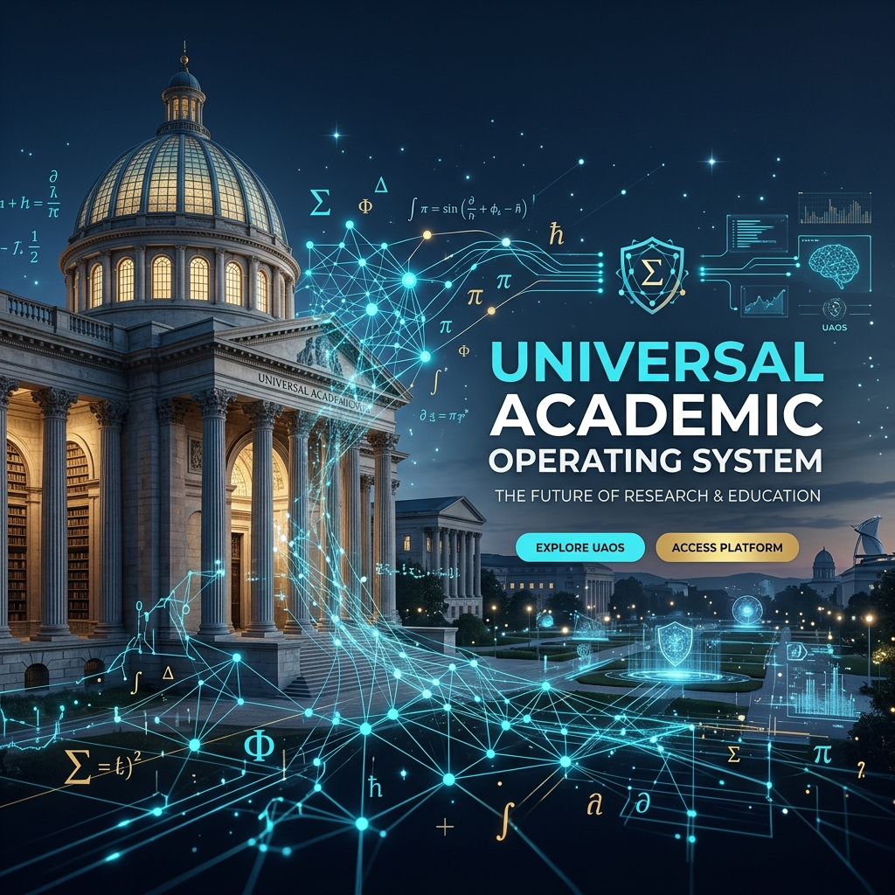

# 🌌 UNIVERSAL ACADEMIC OPERATING SYSTEM (UAOS)
### *A High-Density Knowledge Matrix & Sovereign Intelligence Architecture* 🌐🧬🏗️

---

## 🦾 THE ANTIGRAVITY MANIFESTO: AUTONOMOUS SOVEREIGNTY
**UAOS** is not a passive archive—it is an **Active Intelligence Ecosystem**. In the age of hyper-saturated data and AI-driven synthesis, the value of knowledge lies in its **Architecture**. 

Developed in collaboration between the USER and **Antigravity**, this repository serves as a private, high-fidelity cognitive foundation. We bypass the "conservative" boundaries of fragmented education to build a unified epistemic matrix where technical precision, humanistic depth, and strategic foresight converge into a single sovereign mind.

---

## ⚙️ SYSTEMATIC STRUCTURE: 7-LAYER SOVEREIGN PROTOCOL (00-06)
UAOS is governed by a rigid **Systemum Standard**, ensuring that every node of knowledge is developed from foundational theory to industrial-grade production. This protocol elevates the learner from a consumer to an autonomous architect:

> [!TIP]
> **Evolutionary Path:** Data -> Information -> Knowledge -> Sovereign Wisdom. Use this structure to move from passive learning (00-02) to active creation (04-06).

1. **`00 — Preparation & Orientation`**: Lexical mastery, methodological setup, and environmental configuration.
2. **`01 — Theoretical Foundations`**: Axiomatic principles, mathematical modeling, and core discipline physics.
3. **`02 — Core Implementation`**: Mandatory domain expertise and functional application frameworks.
4. **`03 — Deep Expertise`**: Specialized niche research and high-fidelity technical documentation.
5. **`04 — R&D & Advanced Production`**: Capstone projects, original syntheses, and autonomous intellectual outputs.
6. **`05 — Academic Integration`**: Postgraduate research alignment and scholarly communication standards.
7. **`06 — Industry & Career Nexus`**: Global standard compliance (ISO, IEEE, MISRA), certifications, and professional deployment.

---

## 🏛️ ARCHITECTURAL VISION: THE EPISTEMIC SYNTHESIS
UAOS is the digital manifestation of a world where science and wisdom are no longer separate. We employ a **"Bimodal Expertise"** model, where technical rigor is tempered by philosophical depth. This is the **Epistemic Synthesis**—the bridge between the "How" of engineering and the "Why" of the humanities.

The architecture stands on three primary pillars of sovereignty:
- **Global Inventory:** Mapping the entire known academic universe as a structured, navigable grid.
- **Multidimensional Integrity:** Merging empirical data with ethical insight to create a "Unified Intelligence Model."
- **Recursive Evolution:** Every node in this system is designed to be updated, expanded, and refined by the USER and Antigravity.

| 🧩 Core Doctrine | 🏗️ UAOS Operational Principle |
| :--- | :--- |
| **"Knowledge without application is noise."** | **Autonomous Production-First Mandate** |
| **"Ethics and Engineering are a Single Unit."** | **Bimodal Integrity Integration** |
| **"Systemic Order is the Key to Mastery."** | **Hierarchical Epistemological Precision** |

---

## 🛠️ THE INTELLIGENCE STACK (CORE TOOLS)
UAOS is maintained and expanded using a state-of-the-art **Agentic Ecosystem**:
- **Cognitive Engine:** Gemini 2.0 & Claude 3.5 Sonnet (Synthesizers)
- **Agentic Architect:** **Antigravity** (System Management & Coding)
- **Deep Research:** Perplexity Pro & Scholarly API Integration
- **Knowledge OS:** Obsidian & High-Density Markdown Graphing

---

## 🎯 OPERATION GUIDE: HOW TO MANAGE UAOS
1. **Selection:** Identify a target node via [SUMMARY.md](./SUMMARY.md).
2. **Standardization:** Adhere to the 00-06 protocol during deployment.
3. **Active Synthesis:** Use Layer 04 to produce original, sovereign content.
4. **Agentic Interaction:** Leverage AI agents to cross-link disciplines and detect patterns.

---

## 📖 THE UNIVERSAL DISCIPLINE MATRIX (372 NODES)

The following sectors represent the complete topological map of the UAOS intelligence ecosystem.

<b>🛠️ Mühendislik & İleri Teknoloji (64 Alan)</b>

 

| Branş / Alan | Akademik Misyon & Stratejik Odak |
| :--- | :--- |
| [Adli Bilişim Mühendisliği](meta_muhendislik/adli_bilisim_muhendisligi/) | Advanced engineering node focused on systemic optimization and empirical integrity. |
| [Akilli Gorsel Isitsel Muhendislik](meta_muhendislik/akilli_gorsel_isitsel_muhendislik/) | Advanced engineering node focused on systemic optimization and empirical integrity. |
| [Akilli Molekuler Muhendislik](meta_muhendislik/akilli_molekuler_muhendislik/) | Advanced engineering node focused on systemic optimization and empirical integrity. |
| [Akilli Sebeke Bilgi Ve Mühendisliği](meta_muhendislik/akilli_sebeke_bilgi_ve_muhendisligi/) | Advanced engineering node focused on systemic optimization and empirical integrity. |
| [Ambalaj Mühendisliği](meta_muhendislik/ambalaj_muhendisligi/) | Advanced engineering node focused on systemic optimization and empirical integrity. |
| [Basim Teknolojileri](meta_muhendislik/basim_teknolojileri/) | Professional knowledge repository for the Basim Teknolojileri discipline. |
| [Beyin Bilgisayar Arayuzu Bci Mühendisliği](meta_muhendislik/beyin_bilgisayar_arayuzu_bci_muhendisligi/) | Advanced engineering node focused on systemic optimization and empirical integrity. |
| [Bilgisayar Mühendisliği](meta_muhendislik/bilgisayar_muhendisligi/) | Advanced engineering node focused on systemic optimization and empirical integrity. |
| [Bilişim Sistemleri Mühendisliği](meta_muhendislik/bilisim_sistemleri_muhendisligi/) | Advanced engineering node focused on systemic optimization and empirical integrity. |
| [Biyokimya Mühendisliği](meta_muhendislik/biyokimya_muhendisligi/) | Advanced engineering node focused on systemic optimization and empirical integrity. |
| [Biyomedikal Mühendisliği](meta_muhendislik/biyomedikal_muhendisligi/) | Advanced engineering node focused on systemic optimization and empirical integrity. |
| [Biyosistem Mühendisliği](meta_muhendislik/biyosistem_muhendisligi/) | Advanced engineering node focused on systemic optimization and empirical integrity. |
| [Cevher Hazirlama Mühendisliği](meta_muhendislik/cevher_hazirlama_muhendisligi/) | Advanced engineering node focused on systemic optimization and empirical integrity. |
| [Cevre Mühendisliği](meta_muhendislik/cevre_muhendisligi/) | Advanced engineering node focused on systemic optimization and empirical integrity. |
| [Deniz Ulastirma İşletme Mühendisliği](meta_muhendislik/deniz_ulastirma_isletme_muhendisligi/) | Advanced engineering node focused on systemic optimization and empirical integrity. |
| [Deri Mühendisliği](meta_muhendislik/deri_muhendisligi/) | Advanced engineering node focused on systemic optimization and empirical integrity. |
| [Dusuk Irtifa Teknolojisi Ve Iha](meta_muhendislik/dusuk_irtifa_teknolojisi_ve_iha/) | Professional knowledge repository for the Dusuk Irtifa Teknolojisi Ve Iha discipline. |
| [Elektrik Elektronik Mühendisliği](meta_muhendislik/elektrik_elektronik_muhendisligi/) | Enerji, sinyal ve sistem teorisinin modern mühendislik zirvesi. |
| [Elektronik Ve Haberlesme Mühendisliği](meta_muhendislik/elektronik_ve_haberlesme_muhendisligi/) | Advanced engineering node focused on systemic optimization and empirical integrity. |
| [Endustri Mühendisliği](meta_muhendislik/endustri_muhendisligi/) | Advanced engineering node focused on systemic optimization and empirical integrity. |
| [Endustriyel Tasarim Mühendisliği](meta_muhendislik/endustriyel_tasarim_muhendisligi/) | Advanced engineering node focused on systemic optimization and empirical integrity. |
| [Enerji Sistemleri Mühendisliği](meta_muhendislik/enerji_sistemleri_muhendisligi/) | Advanced engineering node focused on systemic optimization and empirical integrity. |
| [Finans Mühendisliği](meta_muhendislik/finans_muhendisligi/) | Advanced engineering node focused on systemic optimization and empirical integrity. |
| [Fizik Mühendisliği](meta_muhendislik/fizik_muhendisligi/) | Advanced engineering node focused on systemic optimization and empirical integrity. |
| [Gemi İnşaati Ve Gemi Makineleri Mühendisliği](meta_muhendislik/gemi_insaati_ve_gemi_makineleri_muhendisligi/) | Advanced engineering node focused on systemic optimization and empirical integrity. |
| [Gemi Makineleri İşletme Mühendisliği](meta_muhendislik/gemi_makineleri_isletme_muhendisligi/) | Advanced engineering node focused on systemic optimization and empirical integrity. |
| [Geomatik Mühendisliği](meta_muhendislik/geomatik_muhendisligi/) | Advanced engineering node focused on systemic optimization and empirical integrity. |
| [Gida Mühendisliği](meta_muhendislik/gida_muhendisligi/) | Advanced engineering node focused on systemic optimization and empirical integrity. |
| [Harita Mühendisliği](meta_muhendislik/harita_muhendisligi/) | Advanced engineering node focused on systemic optimization and empirical integrity. |
| [Havacilik Ve Uzay Mühendisliği](meta_muhendislik/havacilik_ve_uzay_muhendisligi/) | Yeryüzü sınırlarını aşan yüksek fizik ve itki mühendisliği. |
| [Imalat Mühendisliği](meta_muhendislik/imalat_muhendisligi/) | Advanced engineering node focused on systemic optimization and empirical integrity. |
| [İnşaat Mühendisliği](meta_muhendislik/insaat_muhendisligi/) | Advanced engineering node focused on systemic optimization and empirical integrity. |
| [Ipek Mühendisliği Ve Serikultur](meta_muhendislik/ipek_muhendisligi_ve_serikultur/) | Advanced engineering node focused on systemic optimization and empirical integrity. |
| [İşletme Mühendisliği](meta_muhendislik/isletme_muhendisligi/) | Advanced engineering node focused on systemic optimization and empirical integrity. |
| [Jeofizik Mühendisliği](meta_muhendislik/jeofizik_muhendisligi/) | Advanced engineering node focused on systemic optimization and empirical integrity. |
| [Jeoloji Mühendisliği](meta_muhendislik/jeoloji_muhendisligi/) | Advanced engineering node focused on systemic optimization and empirical integrity. |
| [Kagit Bilimi Ve Mühendisliği](meta_muhendislik/kagit_bilimi_ve_muhendisligi/) | Advanced engineering node focused on systemic optimization and empirical integrity. |
| [Karbon Notr Bilimi Ve Teknolojisi](meta_muhendislik/karbon_notr_bilimi_ve_teknolojisi/) | Professional knowledge repository for the Karbon Notr Bilimi Ve Teknolojisi discipline. |
| [Kimya Mühendisliği](meta_muhendislik/kimya_muhendisligi/) | Advanced engineering node focused on systemic optimization and empirical integrity. |
| [Kontrol Ve Otomasyon Mühendisliği](meta_muhendislik/kontrol_ve_otomasyon_muhendisligi/) | Advanced engineering node focused on systemic optimization and empirical integrity. |
| [Maden Mühendisliği](meta_muhendislik/maden_muhendisligi/) | Advanced engineering node focused on systemic optimization and empirical integrity. |
| [Makine Mühendisliği](meta_muhendislik/makine_muhendisligi/) | Advanced engineering node focused on systemic optimization and empirical integrity. |
| [Matematik Mühendisliği](meta_muhendislik/matematik_muhendisligi/) | Advanced engineering node focused on systemic optimization and empirical integrity. |
| [Mekatronik Mühendisliği](meta_muhendislik/mekatronik_muhendisligi/) | Advanced engineering node focused on systemic optimization and empirical integrity. |
| [Metalurji Ve Malzeme Mühendisliği](meta_muhendislik/metalurji_ve_malzeme_muhendisligi/) | Advanced engineering node focused on systemic optimization and empirical integrity. |
| [Mikro Nano Sistemler Ve Mems](meta_muhendislik/mikro_nano_sistemler_ve_mems/) | Professional knowledge repository for the Mikro Nano Sistemler Ve Mems discipline. |
| [Modelleme Ve Simulasyon](meta_muhendislik/modelleme_ve_simulasyon/) | Professional knowledge repository for the Modelleme Ve Simulasyon discipline. |
| [Nanoteknoloji Mühendisliği](meta_muhendislik/nanoteknoloji_muhendisligi/) | Advanced engineering node focused on systemic optimization and empirical integrity. |
| [Nukleer Enerji Mühendisliği](meta_muhendislik/nukleer_enerji_muhendisligi/) | Advanced engineering node focused on systemic optimization and empirical integrity. |
| [Orman Mühendisliği](meta_muhendislik/orman_muhendisligi/) | Advanced engineering node focused on systemic optimization and empirical integrity. |
| [Otomotiv Mühendisliği](meta_muhendislik/otomotiv_muhendisligi/) | Advanced engineering node focused on systemic optimization and empirical integrity. |
| [Rayli Sistemler Mühendisliği](meta_muhendislik/rayli_sistemler_muhendisligi/) | Advanced engineering node focused on systemic optimization and empirical integrity. |
| [Seramik Tasarimi Ve Mühendisliği](meta_muhendislik/seramik_tasarimi_ve_muhendisligi/) | Advanced engineering node focused on systemic optimization and empirical integrity. |
| [Siber Guvenlik Mühendisliği](meta_muhendislik/siber_guvenlik_muhendisligi/) | Dijital kalelerin savunma ve strateji merkezi. |
| [Su Urunleri Mühendisliği](meta_muhendislik/su_urunleri_muhendisligi/) | Advanced engineering node focused on systemic optimization and empirical integrity. |
| [Tarim Makineleri Ve Teknolojileri Mühendisliği](meta_muhendislik/tarim_makineleri_ve_teknolojileri_muhendisligi/) | Advanced engineering node focused on systemic optimization and empirical integrity. |
| [Tekstil Mühendisliği](meta_muhendislik/tekstil_muhendisligi/) | Advanced engineering node focused on systemic optimization and empirical integrity. |
| [Ucak Mühendisliği](meta_muhendislik/ucak_muhendisligi/) | Advanced engineering node focused on systemic optimization and empirical integrity. |
| [Ulaşım Mühendisliği](meta_muhendislik/ulasim_muhendisligi/) | Advanced engineering node focused on systemic optimization and empirical integrity. |
| [Uzay Zaman Bilgi Mühendisliği](meta_muhendislik/uzay_zaman_bilgi_muhendisligi/) | Advanced engineering node focused on systemic optimization and empirical integrity. |
| [Yapay Zeka Ve Veri Mühendisliği](meta_muhendislik/yapay_zeka_ve_veri_muhendisligi/) | Veriden anlam çıkaran otonom sistemlerin mimarisi. |
| [Yazilim Mühendisliği](meta_muhendislik/yazilim_muhendisligi/) | Advanced engineering node focused on systemic optimization and empirical integrity. |
| [Yuksek Guclu Yariiletken Bilimi Ve Mühendisliği](meta_muhendislik/yuksek_guclu_yariiletken_bilimi_ve_muhendisligi/) | Advanced engineering node focused on systemic optimization and empirical integrity. |
| [Ziraat Mühendisliği](meta_muhendislik/ziraat_muhendisligi/) | Advanced engineering node focused on systemic optimization and empirical integrity. |

<b>🏛️ Mimarlık, Tasarım & Şehircilik (15 Alan)</b>

 

| Branş / Alan | Akademik Misyon & Stratejik Odak |
| :--- | :--- |
| [Cizgi Film Ve Animasyon](mimarlik_ve_tasarim/cizgi_film_ve_animasyon/) | Professional knowledge repository for the Cizgi Film Ve Animasyon discipline. |
| [Endustriyel Tasarim](mimarlik_ve_tasarim/endustriyel_tasarim/) | Professional knowledge repository for the Endustriyel Tasarim discipline. |
| [Gorsel Iletisim Tasarimi](mimarlik_ve_tasarim/gorsel_iletisim_tasarimi/) | Professional knowledge repository for the Gorsel Iletisim Tasarimi discipline. |
| [Grafik Tasarimi](mimarlik_ve_tasarim/grafik_tasarimi/) | Professional knowledge repository for the Grafik Tasarimi discipline. |
| [Ic Mimarlik Ve Cevre Tasarimi](mimarlik_ve_tasarim/ic_mimarlik_ve_cevre_tasarimi/) | Professional knowledge repository for the Ic Mimarlik Ve Cevre Tasarimi discipline. |
| [Kultur Varliklarini Koruma Ve Onarim](mimarlik_ve_tasarim/kultur_varliklarini_koruma_ve_onarim/) | Professional knowledge repository for the Kultur Varliklarini Koruma Ve Onarim discipline. |
| [Kuyumculuk Ve Mucevher Tasarimi](mimarlik_ve_tasarim/kuyumculuk_ve_mucevher_tasarimi/) | Professional knowledge repository for the Kuyumculuk Ve Mucevher Tasarimi discipline. |
| [Mimarlik](mimarlik_ve_tasarim/mimarlik/) | Professional knowledge repository for the Mimarlik discipline. |
| [Mucevherat Ve Degerli Tas Bilimi](mimarlik_ve_tasarim/mucevherat_ve_degerli_tas_bilimi/) | Professional knowledge repository for the Mucevherat Ve Degerli Tas Bilimi discipline. |
| [Muzik](mimarlik_ve_tasarim/muzik/) | Professional knowledge repository for the Muzik discipline. |
| [Peyzaj Mimarligi](mimarlik_ve_tasarim/peyzaj_mimarligi/) | Professional knowledge repository for the Peyzaj Mimarligi discipline. |
| [Sehir Ve Bolge Planlama](mimarlik_ve_tasarim/sehir_ve_bolge_planlama/) | Professional knowledge repository for the Sehir Ve Bolge Planlama discipline. |
| [Seramik Ve Cam Tasarimi](mimarlik_ve_tasarim/seramik_ve_cam_tasarimi/) | Professional knowledge repository for the Seramik Ve Cam Tasarimi discipline. |
| [Tekstil Ve Moda Tasarimi](mimarlik_ve_tasarim/tekstil_ve_moda_tasarimi/) | Professional knowledge repository for the Tekstil Ve Moda Tasarimi discipline. |
| [Tiyatro Oyunculuk](mimarlik_ve_tasarim/tiyatro_oyunculuk/) | Professional knowledge repository for the Tiyatro Oyunculuk discipline. |

<b>🖼️ Güzel Sanatlar & Estetik (8 Alan)</b>

 

| Branş / Alan | Akademik Misyon & Stratejik Odak |
| :--- | :--- |
| [Dijital Tiyatro](guzel_sanatlar/dijital_tiyatro/) | Professional knowledge repository for the Dijital Tiyatro discipline. |
| [El Sanatlari](guzel_sanatlar/el_sanatlari/) | Professional knowledge repository for the El Sanatlari discipline. |
| [Fotograf](guzel_sanatlar/fotograf/) | Professional knowledge repository for the Fotograf discipline. |
| [Geleneksel Cin Operasi Ve Muzigi](guzel_sanatlar/geleneksel_cin_operasi_ve_muzigi/) | Professional knowledge repository for the Geleneksel Cin Operasi Ve Muzigi discipline. |
| [Geleneksel Turk Sanatlari](guzel_sanatlar/geleneksel_turk_sanatlari/) | Professional knowledge repository for the Geleneksel Turk Sanatlari discipline. |
| [Guzel Sanatlar Arastirma](guzel_sanatlar/guzel_sanatlar_arastirma/) | Professional knowledge repository for the Guzel Sanatlar Arastirma discipline. |
| [Heykel](guzel_sanatlar/heykel/) | Professional knowledge repository for the Heykel discipline. |
| [Resim](guzel_sanatlar/resim/) | Professional knowledge repository for the Resim discipline. |

<b>🩺 Sağlık Bilimleri & Tıp (30 Alan)</b>

 

| Branş / Alan | Akademik Misyon & Stratejik Odak |
| :--- | :--- |
| [Acil Yardim Ve Afet Yonetimi](saglik/acil_yardim_ve_afet_yonetimi/) | Strategic operations and decision-intelligence framework for organizational mastery. |
| [Akupunktur Ve Moxibustion](saglik/akupunktur_ve_moxibustion/) | Professional knowledge repository for the Akupunktur Ve Moxibustion discipline. |
| [Ameliyathane Hizmetleri](saglik/ameliyathane_hizmetleri/) | Professional knowledge repository for the Ameliyathane Hizmetleri discipline. |
| [Anestezi Ve Reanimasyon](saglik/anestezi_ve_reanimasyon/) | Professional knowledge repository for the Anestezi Ve Reanimasyon discipline. |
| [Beslenme Ve Diyetetik](saglik/beslenme_ve_diyetetik/) | Professional knowledge repository for the Beslenme Ve Diyetetik discipline. |
| [Cocuk Gelisimi](saglik/cocuk_gelisimi/) | Professional knowledge repository for the Cocuk Gelisimi discipline. |
| [Dil Ve Konusma Terapisi](saglik/dil_ve_konusma_terapisi/) | Professional knowledge repository for the Dil Ve Konusma Terapisi discipline. |
| [Dis Hekimligi](saglik/dis_hekimligi/) | Professional knowledge repository for the Dis Hekimligi discipline. |
| [Ebelik](saglik/ebelik/) | Professional knowledge repository for the Ebelik discipline. |
| [Eczacilik](saglik/eczacilik/) | Professional knowledge repository for the Eczacilik discipline. |
| [Ergoterapi](saglik/ergoterapi/) | Professional knowledge repository for the Ergoterapi discipline. |
| [Fizyoterapi Ve Rehabilitasyon](saglik/fizyoterapi_ve_rehabilitasyon/) | Professional knowledge repository for the Fizyoterapi Ve Rehabilitasyon discipline. |
| [Geleneksel Cin Tibbi](saglik/geleneksel_cin_tibbi/) | Professional knowledge repository for the Geleneksel Cin Tibbi discipline. |
| [Geleneksel Cin Veteriner Hekimligi](saglik/geleneksel_cin_veteriner_hekimligi/) | Professional knowledge repository for the Geleneksel Cin Veteriner Hekimligi discipline. |
| [Gerontoloji](saglik/gerontoloji/) | Professional knowledge repository for the Gerontoloji discipline. |
| [Hemsirelik](saglik/hemsirelik/) | Professional knowledge repository for the Hemsirelik discipline. |
| [Is Ve Ugrasi Terapisi](saglik/is_ve_ugrasi_terapisi/) | Professional knowledge repository for the Is Ve Ugrasi Terapisi discipline. |
| [Medikal Cihaz Ve Ekipman Mühendisliği](saglik/medikal_cihaz_ve_ekipman_muhendisligi/) | Advanced engineering node focused on systemic optimization and empirical integrity. |
| [Molekuler Biyoloji Ve Genetik](saglik/molekuler_biyoloji_ve_genetik/) | Professional knowledge repository for the Molekuler Biyoloji Ve Genetik discipline. |
| [Nukleer Eczacilik](saglik/nukleer_eczacilik/) | Professional knowledge repository for the Nukleer Eczacilik discipline. |
| [Odyoloji](saglik/odyoloji/) | Professional knowledge repository for the Odyoloji discipline. |
| [Ozurluluk Calismalari](saglik/ozurluluk_calismalari/) | Professional knowledge repository for the Ozurluluk Calismalari discipline. |
| [Perfuzyon](saglik/perfuzyon/) | Professional knowledge repository for the Perfuzyon discipline. |
| [Saglik Bilimi Ve Teknolojisi](saglik/saglik_bilimi_ve_teknolojisi/) | Professional knowledge repository for the Saglik Bilimi Ve Teknolojisi discipline. |
| [Saglik Ve Tibbi Guvenlik](saglik/saglik_ve_tibbi_guvenlik/) | Professional knowledge repository for the Saglik Ve Tibbi Guvenlik discipline. |
| [Saglik Yonetimi](saglik/saglik_yonetimi/) | Strategic operations and decision-intelligence framework for organizational mastery. |
| [Tibbi Goruntuleme Teknikleri](saglik/tibbi_goruntuleme_teknikleri/) | Professional knowledge repository for the Tibbi Goruntuleme Teknikleri discipline. |
| [Tibbi Laboratuvar Teknikleri](saglik/tibbi_laboratuvar_teknikleri/) | Professional knowledge repository for the Tibbi Laboratuvar Teknikleri discipline. |
| [Tip](saglik/tip/) | Professional knowledge repository for the Tip discipline. |
| [Veterinerlik](saglik/veterinerlik/) | Professional knowledge repository for the Veterinerlik discipline. |

<b>🎓 Eğitim Fakültesi & Pedagoji (16 Alan)</b>

 

| Branş / Alan | Akademik Misyon & Stratejik Odak |
| :--- | :--- |
| [Beden Egitimi Ve Spor Ogretmenligi](ogretmenlik/beden_egitimi_ve_spor_ogretmenligi/) | Professional knowledge repository for the Beden Egitimi Ve Spor Ogretmenligi discipline. |
| [Bilgisayar Ve Ogretim Teknolojileri Egitimi](ogretmenlik/bilgisayar_ve_ogretim_teknolojileri_egitimi/) | Professional knowledge repository for the Bilgisayar Ve Ogretim Teknolojileri Egitimi discipline. |
| [Din Kulturu Ve Ahlak Bilgisi Ogretmenligi](ogretmenlik/din_kulturu_ve_ahlak_bilgisi_ogretmenligi/) | Professional knowledge repository for the Din Kulturu Ve Ahlak Bilgisi Ogretmenligi discipline. |
| [Egitim Yonetimi](ogretmenlik/egitim_yonetimi/) | Strategic operations and decision-intelligence framework for organizational mastery. |
| [Fen Bilgisi Ogretmenligi](ogretmenlik/fen_bilgisi_ogretmenligi/) | Professional knowledge repository for the Fen Bilgisi Ogretmenligi discipline. |
| [Ilkogretim Matematik Ogretmenligi](ogretmenlik/ilkogretim_matematik_ogretmenligi/) | Professional knowledge repository for the Ilkogretim Matematik Ogretmenligi discipline. |
| [Ingilizce Ogretmenligi](ogretmenlik/ingilizce_ogretmenligi/) | Professional knowledge repository for the Ingilizce Ogretmenligi discipline. |
| [Muzik Ogretmenligi](ogretmenlik/muzik_ogretmenligi/) | Professional knowledge repository for the Muzik Ogretmenligi discipline. |
| [Okul Oncesi Ogretmenligi](ogretmenlik/okul_oncesi_ogretmenligi/) | Professional knowledge repository for the Okul Oncesi Ogretmenligi discipline. |
| [Ozel Egitim Ogretmenligi](ogretmenlik/ozel_egitim_ogretmenligi/) | Professional knowledge repository for the Ozel Egitim Ogretmenligi discipline. |
| [Rehberlik Ve Psikolojik Danismanlik](ogretmenlik/rehberlik_ve_psikolojik_danismanlik/) | Professional knowledge repository for the Rehberlik Ve Psikolojik Danismanlik discipline. |
| [Resim Is Ogretmenligi](ogretmenlik/resim_is_ogretmenligi/) | Professional knowledge repository for the Resim Is Ogretmenligi discipline. |
| [Saglik Bilgisi Ogretmenligi](ogretmenlik/saglik_bilgisi_ogretmenligi/) | Professional knowledge repository for the Saglik Bilgisi Ogretmenligi discipline. |
| [Sinif Ogretmenligi](ogretmenlik/sinif_ogretmenligi/) | Professional knowledge repository for the Sinif Ogretmenligi discipline. |
| [Sosyal Bilgiler Ogretmenligi](ogretmenlik/sosyal_bilgiler_ogretmenligi/) | Professional knowledge repository for the Sosyal Bilgiler Ogretmenligi discipline. |
| [Turkce Ogretmenligi](ogretmenlik/turkce_ogretmenligi/) | Professional knowledge repository for the Turkce Ogretmenligi discipline. |

<b>🏅 Spor Bilimleri & Performans (8 Alan)</b>

 

| Branş / Alan | Akademik Misyon & Stratejik Odak |
| :--- | :--- |
| [Antrenorluk Egitimi](spor_bilimleri/antrenorluk_egitimi/) | Professional knowledge repository for the Antrenorluk Egitimi discipline. |
| [Beden Egitimi Ve Spor Bilimleri](spor_bilimleri/beden_egitimi_ve_spor_bilimleri/) | Professional knowledge repository for the Beden Egitimi Ve Spor Bilimleri discipline. |
| [Buz Ve Kar Dansi Performansi](spor_bilimleri/buz_ve_kar_dansi_performansi/) | Professional knowledge repository for the Buz Ve Kar Dansi Performansi discipline. |
| [Futbol Bilimi](spor_bilimleri/futbol_bilimi/) | Professional knowledge repository for the Futbol Bilimi discipline. |
| [Geleneksel Cin Savas Sanatlari Wushu](spor_bilimleri/geleneksel_cin_savas_sanatlari_wushu/) | Professional knowledge repository for the Geleneksel Cin Savas Sanatlari Wushu discipline. |
| [Havacilik Sporlari](spor_bilimleri/havacilik_sporlari/) | Professional knowledge repository for the Havacilik Sporlari discipline. |
| [Rekreasyon](spor_bilimleri/rekreasyon/) | Professional knowledge repository for the Rekreasyon discipline. |
| [Spor Yoneticiligi](spor_bilimleri/spor_yoneticiligi/) | Professional knowledge repository for the Spor Yoneticiligi discipline. |

<b>⚖️ Sosyal, Beşeri & İdari Bilimler (39 Alan)</b>

 

| Branş / Alan | Akademik Misyon & Stratejik Odak |
| :--- | :--- |
| [Aktüerya Bilimleri](sosyal_ve_beseri_bilimler/aktüerya_bilimleri/) | Professional knowledge repository for the Aktüerya Bilimleri discipline. |
| [Antropoloji](sosyal_ve_beseri_bilimler/antropoloji/) | Professional knowledge repository for the Antropoloji discipline. |
| [Arkeoloji](sosyal_ve_beseri_bilimler/arkeoloji/) | Professional knowledge repository for the Arkeoloji discipline. |
| [Bolgesel Ve Ulke Arastirmalari](sosyal_ve_beseri_bilimler/bolgesel_ve_ulke_arastirmalari/) | Professional knowledge repository for the Bolgesel Ve Ulke Arastirmalari discipline. |
| [Calisma Ekonomisi Ve Endustri Iliskileri](sosyal_ve_beseri_bilimler/calisma_ekonomisi_ve_endustri_iliskileri/) | Professional knowledge repository for the Calisma Ekonomisi Ve Endustri Iliskileri discipline. |
| [Cografya](sosyal_ve_beseri_bilimler/cografya/) | Professional knowledge repository for the Cografya discipline. |
| [Dilbilim](sosyal_ve_beseri_bilimler/dilbilim/) | Professional knowledge repository for the Dilbilim discipline. |
| [Dis Ticaret](sosyal_ve_beseri_bilimler/dis_ticaret/) | Professional knowledge repository for the Dis Ticaret discipline. |
| [Ekonometri](sosyal_ve_beseri_bilimler/ekonometri/) | Professional knowledge repository for the Ekonometri discipline. |
| [Ekonomi](sosyal_ve_beseri_bilimler/ekonomi/) | Professional knowledge repository for the Ekonomi discipline. |
| [Enerji Yonetimi](sosyal_ve_beseri_bilimler/enerji_yonetimi/) | Strategic operations and decision-intelligence framework for organizational mastery. |
| [Felsefe](sosyal_ve_beseri_bilimler/felsefe/) | Professional knowledge repository for the Felsefe discipline. |
| [Girisimcilik](sosyal_ve_beseri_bilimler/girisimcilik/) | Professional knowledge repository for the Girisimcilik discipline. |
| [Halk Bilimi](sosyal_ve_beseri_bilimler/halk_bilimi/) | Professional knowledge repository for the Halk Bilimi discipline. |
| [Halkbilimi](sosyal_ve_beseri_bilimler/halkbilimi/) | Professional knowledge repository for the Halkbilimi discipline. |
| [Havacilik Yonetimi](sosyal_ve_beseri_bilimler/havacilik_yonetimi/) | Strategic operations and decision-intelligence framework for organizational mastery. |
| [Iktisat](sosyal_ve_beseri_bilimler/iktisat/) | Professional knowledge repository for the Iktisat discipline. |
| [Insan Kaynaklari Yonetimi](sosyal_ve_beseri_bilimler/insan_kaynaklari_yonetimi/) | Strategic operations and decision-intelligence framework for organizational mastery. |
| [İşletme](sosyal_ve_beseri_bilimler/isletme/) | Professional knowledge repository for the Isletme discipline. |
| [Kutuphanecilik Ve Bilgi Yonetimi](sosyal_ve_beseri_bilimler/kutuphanecilik_ve_bilgi_yonetimi/) | Strategic operations and decision-intelligence framework for organizational mastery. |
| [Lojistik Yonetimi](sosyal_ve_beseri_bilimler/lojistik_yonetimi/) | Strategic operations and decision-intelligence framework for organizational mastery. |
| [Maliye](sosyal_ve_beseri_bilimler/maliye/) | Professional knowledge repository for the Maliye discipline. |
| [Muhasebe Ve Finans Yonetimi](sosyal_ve_beseri_bilimler/muhasebe_ve_finans_yonetimi/) | Strategic operations and decision-intelligence framework for organizational mastery. |
| [Muze Yonetimi](sosyal_ve_beseri_bilimler/muze_yonetimi/) | Strategic operations and decision-intelligence framework for organizational mastery. |
| [Muzeoloji Ve Arsivcilik](sosyal_ve_beseri_bilimler/muzeoloji_ve_arsivcilik/) | Professional knowledge repository for the Muzeoloji Ve Arsivcilik discipline. |
| [Psikoloji](sosyal_ve_beseri_bilimler/psikoloji/) | Professional knowledge repository for the Psikoloji discipline. |
| [Sanat Tarihi](sosyal_ve_beseri_bilimler/sanat_tarihi/) | Professional knowledge repository for the Sanat Tarihi discipline. |
| [Sanat Yonetimi](sosyal_ve_beseri_bilimler/sanat_yonetimi/) | Strategic operations and decision-intelligence framework for organizational mastery. |
| [Sigortacilik Ve Risk Yonetimi](sosyal_ve_beseri_bilimler/sigortacilik_ve_risk_yonetimi/) | Strategic operations and decision-intelligence framework for organizational mastery. |
| [Siyaset Bilimi Ve Kamu Yonetimi](sosyal_ve_beseri_bilimler/siyaset_bilimi_ve_kamu_yonetimi/) | Strategic operations and decision-intelligence framework for organizational mastery. |
| [Sosyal Hizmet](sosyal_ve_beseri_bilimler/sosyal_hizmet/) | Professional knowledge repository for the Sosyal Hizmet discipline. |
| [Sosyoloji](sosyal_ve_beseri_bilimler/sosyoloji/) | Professional knowledge repository for the Sosyoloji discipline. |
| [Stratejik Hammadde Ekonomisi](sosyal_ve_beseri_bilimler/stratejik_hammadde_ekonomisi/) | Professional knowledge repository for the Stratejik Hammadde Ekonomisi discipline. |
| [Su Sektoru Ekonomisi Ve Yonetimi](sosyal_ve_beseri_bilimler/su_sektoru_ekonomisi_ve_yonetimi/) | Strategic operations and decision-intelligence framework for organizational mastery. |
| [Tarih](sosyal_ve_beseri_bilimler/tarih/) | Professional knowledge repository for the Tarih discipline. |
| [Uluslararasi Iliskiler](sosyal_ve_beseri_bilimler/uluslararasi_iliskiler/) | Professional knowledge repository for the Uluslararasi Iliskiler discipline. |
| [Uluslararasi Ticaret Ve Lojistik](sosyal_ve_beseri_bilimler/uluslararasi_ticaret_ve_lojistik/) | Professional knowledge repository for the Uluslararasi Ticaret Ve Lojistik discipline. |
| [Yenilik Yonetimi](sosyal_ve_beseri_bilimler/yenilik_yonetimi/) | Strategic operations and decision-intelligence framework for organizational mastery. |
| [Yonetim Bilişim Sistemleri](sosyal_ve_beseri_bilimler/yonetim_bilisim_sistemleri/) | Professional knowledge repository for the Yonetim Bilisim Sistemleri discipline. |

<b>🧪 Temel Fen Bilimleri (12 Alan)</b>

 

| Branş / Alan | Akademik Misyon & Stratejik Odak |
| :--- | :--- |
| [Astronomi Ve Uzay Bilimleri](temel_bilimler/astronomi_ve_uzay_bilimleri/) | Professional knowledge repository for the Astronomi Ve Uzay Bilimleri discipline. |
| [Biyoistatistik](temel_bilimler/biyoistatistik/) | Professional knowledge repository for the Biyoistatistik discipline. |
| [Biyoloji](temel_bilimler/biyoloji/) | Professional knowledge repository for the Biyoloji discipline. |
| [Deniz Bilimleri Ve Teknolojisi](temel_bilimler/deniz_bilimleri_ve_teknolojisi/) | Professional knowledge repository for the Deniz Bilimleri Ve Teknolojisi discipline. |
| [Ekolojik Restorasyon](temel_bilimler/ekolojik_restorasyon/) | Professional knowledge repository for the Ekolojik Restorasyon discipline. |
| [Fizik](temel_bilimler/fizik/) | Professional knowledge repository for the Fizik discipline. |
| [Istatistik](temel_bilimler/istatistik/) | Professional knowledge repository for the Istatistik discipline. |
| [Jeoloji](temel_bilimler/jeoloji/) | Professional knowledge repository for the Jeoloji discipline. |
| [Kimya](temel_bilimler/kimya/) | Professional knowledge repository for the Kimya discipline. |
| [Matematik](temel_bilimler/matematik/) | Professional knowledge repository for the Matematik discipline. |
| [Sulak Alan Bilimi Ve Yonetimi](temel_bilimler/sulak_alan_bilimi_ve_yonetimi/) | Strategic operations and decision-intelligence framework for organizational mastery. |
| [Yer Bilimleri](temel_bilimler/yer_bilimleri/) | Professional knowledge repository for the Yer Bilimleri discipline. |

<b>📚 Filoloji, Dil & Edebiyat (17 Alan)</b>

 

| Branş / Alan | Akademik Misyon & Stratejik Odak |
| :--- | :--- |
| [Alman Dili Ve Edebiyati](edebiyat_ve_diller/alman_dili_ve_edebiyati/) | Philological analysis and deep linguistic mapping of cultural data structures. |
| [Arap Dili Ve Edebiyati](edebiyat_ve_diller/arap_dili_ve_edebiyati/) | Philological analysis and deep linguistic mapping of cultural data structures. |
| [Cin Dili Ve Edebiyati](edebiyat_ve_diller/cin_dili_ve_edebiyati/) | Philological analysis and deep linguistic mapping of cultural data structures. |
| [Cin Klasik Calismalari](edebiyat_ve_diller/cin_klasik_calismalari/) | Professional knowledge repository for the Cin Klasik Calismalari discipline. |
| [Dogu Kulturleri Ve Bolge Arastirmalari](edebiyat_ve_diller/dogu_kulturleri_ve_bolge_arastirmalari/) | Professional knowledge repository for the Dogu Kulturleri Ve Bolge Arastirmalari discipline. |
| [Fars Dili Ve Edebiyati](edebiyat_ve_diller/fars_dili_ve_edebiyati/) | Philological analysis and deep linguistic mapping of cultural data structures. |
| [Fransiz Dili Ve Edebiyati](edebiyat_ve_diller/fransiz_dili_ve_edebiyati/) | Philological analysis and deep linguistic mapping of cultural data structures. |
| [Hititoloji](edebiyat_ve_diller/hititoloji/) | Professional knowledge repository for the Hititoloji discipline. |
| [Ingiliz Dili Ve Edebiyati](edebiyat_ve_diller/ingiliz_dili_ve_edebiyati/) | Philological analysis and deep linguistic mapping of cultural data structures. |
| [Ispanyol Dili Ve Edebiyati](edebiyat_ve_diller/ispanyol_dili_ve_edebiyati/) | Philological analysis and deep linguistic mapping of cultural data structures. |
| [Italyan Dili Ve Edebiyati](edebiyat_ve_diller/italyan_dili_ve_edebiyati/) | Philological analysis and deep linguistic mapping of cultural data structures. |
| [Japon Dili Ve Edebiyati](edebiyat_ve_diller/japon_dili_ve_edebiyati/) | Philological analysis and deep linguistic mapping of cultural data structures. |
| [Kore Dili Ve Edebiyati](edebiyat_ve_diller/kore_dili_ve_edebiyati/) | Philological analysis and deep linguistic mapping of cultural data structures. |
| [Mutercim Ve Tercumanlik](edebiyat_ve_diller/mutercim_ve_tercumanlik/) | Professional knowledge repository for the Mutercim Ve Tercumanlik discipline. |
| [Rus Dili Ve Edebiyati](edebiyat_ve_diller/rus_dili_ve_edebiyati/) | Philological analysis and deep linguistic mapping of cultural data structures. |
| [Sumeroloji](edebiyat_ve_diller/sumeroloji/) | Professional knowledge repository for the Sumeroloji discipline. |
| [Turk Dili Ve Edebiyati](edebiyat_ve_diller/turk_dili_ve_edebiyati/) | Philological analysis and deep linguistic mapping of cultural data structures. |

<b>📡 İletişim & Medya Bilimleri (4 Alan)</b>

 

| Branş / Alan | Akademik Misyon & Stratejik Odak |
| :--- | :--- |
| [Gazetecilik](iletisim/gazetecilik/) | Professional knowledge repository for the Gazetecilik discipline. |
| [Halkla Iliskiler Ve Reklamcilik](iletisim/halkla_iliskiler_ve_reklamcilik/) | Professional knowledge repository for the Halkla Iliskiler Ve Reklamcilik discipline. |
| [Radyo Televizyon Ve Sinema](iletisim/radyo_televizyon_ve_sinema/) | Professional knowledge repository for the Radyo Televizyon Ve Sinema discipline. |
| [Yeni Medya Ve Iletisim](iletisim/yeni_medya_ve_iletisim/) | Professional knowledge repository for the Yeni Medya Ve Iletisim discipline. |

<b>🏨 Turizm, Otelcilik & Gastronomi (7 Alan)</b>

 

| Branş / Alan | Akademik Misyon & Stratejik Odak |
| :--- | :--- |
| [Gastronomi Ve Mutfak Sanatlari](turizm_ve_gastronomi/gastronomi_ve_mutfak_sanatlari/) | Professional knowledge repository for the Gastronomi Ve Mutfak Sanatlari discipline. |
| [Kahve Bilimi Ve Mühendisliği](turizm_ve_gastronomi/kahve_bilimi_ve_muhendisligi/) | Advanced engineering node focused on systemic optimization and empirical integrity. |
| [Konaklama İşletmeciligi](turizm_ve_gastronomi/konaklama_isletmeciligi/) | Professional knowledge repository for the Konaklama Isletmeciligi discipline. |
| [Turizm İşletmeciligi](turizm_ve_gastronomi/turizm_isletmeciligi/) | Professional knowledge repository for the Turizm Isletmeciligi discipline. |
| [Turizm Rehberligi](turizm_ve_gastronomi/turizm_rehberligi/) | Professional knowledge repository for the Turizm Rehberligi discipline. |
| [Uluslararasi Kruvaziyer Yonetimi](turizm_ve_gastronomi/uluslararasi_kruvaziyer_yonetimi/) | Strategic operations and decision-intelligence framework for organizational mastery. |
| [Yiyecek Icecek İşletmeciligi](turizm_ve_gastronomi/yiyecek_icecek_isletmeciligi/) | Professional knowledge repository for the Yiyecek Icecek Isletmeciligi discipline. |

<b>🌱 Tarım, Ziraat & Doğa Bilimleri (8 Alan)</b>

 

| Branş / Alan | Akademik Misyon & Stratejik Odak |
| :--- | :--- |
| [Bahce Bitkileri](tarim_ve_ziraat_bilimleri/bahce_bitkileri/) | Professional knowledge repository for the Bahce Bitkileri discipline. |
| [Bitki Koruma](tarim_ve_ziraat_bilimleri/bitki_koruma/) | Professional knowledge repository for the Bitki Koruma discipline. |
| [Biyolojik Islah Teknolojisi](tarim_ve_ziraat_bilimleri/biyolojik_islah_teknolojisi/) | Professional knowledge repository for the Biyolojik Islah Teknolojisi discipline. |
| [Cay Bilimi Ve Teknolojisi](tarim_ve_ziraat_bilimleri/cay_bilimi_ve_teknolojisi/) | Professional knowledge repository for the Cay Bilimi Ve Teknolojisi discipline. |
| [Tarla Bitkileri](tarim_ve_ziraat_bilimleri/tarla_bitkileri/) | Professional knowledge repository for the Tarla Bitkileri discipline. |
| [Toprak Bilimi Ve Bitki Besleme](tarim_ve_ziraat_bilimleri/toprak_bilimi_ve_bitki_besleme/) | Professional knowledge repository for the Toprak Bilimi Ve Bitki Besleme discipline. |
| [Tutun Bilimi](tarim_ve_ziraat_bilimleri/tutun_bilimi/) | Professional knowledge repository for the Tutun Bilimi discipline. |
| [Zootekni](tarim_ve_ziraat_bilimleri/zootekni/) | Professional knowledge repository for the Zootekni discipline. |

<b>⚔️ Savunma Sanayii & Güvenlik Stratejileri (6 Alan)</b>

 

| Branş / Alan | Akademik Misyon & Stratejik Odak |
| :--- | :--- |
| [Askeri Havacilik Ve Uzay](askeri_bilimler_ve_savunma_teknolojileri/askeri_havacilik_ve_uzay/) | Professional knowledge repository for the Askeri Havacilik Ve Uzay discipline. |
| [Askeri Istihbarat Analizi](askeri_bilimler_ve_savunma_teknolojileri/askeri_istihbarat_analizi/) | Professional knowledge repository for the Askeri Istihbarat Analizi discipline. |
| [Deniz Harp Ve Su Alti Stratejileri](askeri_bilimler_ve_savunma_teknolojileri/deniz_harp_ve_su_alti_stratejileri/) | Professional knowledge repository for the Deniz Harp Ve Su Alti Stratejileri discipline. |
| [Komuta Kontrol Ve Strateji](askeri_bilimler_ve_savunma_teknolojileri/komuta_kontrol_ve_strateji/) | Professional knowledge repository for the Komuta Kontrol Ve Strateji discipline. |
| [Savunma Yonetimi Ve Lojistik](askeri_bilimler_ve_savunma_teknolojileri/savunma_yonetimi_ve_lojistik/) | Strategic operations and decision-intelligence framework for organizational mastery. |
| [Siber Savunma Ve Elektronik Harp](askeri_bilimler_ve_savunma_teknolojileri/siber_savunma_ve_elektronik_harp/) | Professional knowledge repository for the Siber Savunma Ve Elektronik Harp discipline. |

<b>⚖️ Adalet & Hukuk Bilimleri (2 Alan)</b>

 

| Branş / Alan | Akademik Misyon & Stratejik Odak |
| :--- | :--- |
| [Deniz Hukuku Ve Stratejisi](hukuk_bilimi/deniz_hukuku_ve_stratejisi/) | Professional knowledge repository for the Deniz Hukuku Ve Stratejisi discipline. |
| [Hukuk](hukuk_bilimi/hukuk/) | Professional knowledge repository for the Hukuk discipline. |

<b>📚 Theology, Comparative Religion & Philosophy (1 Alan)</b>

 

| Branş / Alan | Akademik Misyon & Stratejik Odak |
| :--- | :--- |
| [Ilahiyat](ilahiyat_ve_din/ilahiyat/) | Professional knowledge repository for the Ilahiyat discipline. |

<b>📋 Mesleki Yüksekokul (Ön Lisans) (72 Alan)</b>

 

| Branş / Alan | Akademik Misyon & Stratejik Odak |
| :--- | :--- |
| [Adalet](on_lisans_programlari/adalet/) | Professional knowledge repository for the Adalet discipline. |
| [Agiz Ve Dis Sagligi](on_lisans_programlari/agiz_ve_dis_sagligi/) | Professional knowledge repository for the Agiz Ve Dis Sagligi discipline. |
| [Aricilik](on_lisans_programlari/aricilik/) | Professional knowledge repository for the Aricilik discipline. |
| [Asansor Teknolojisi](on_lisans_programlari/asansor_teknolojisi/) | Professional knowledge repository for the Asansor Teknolojisi discipline. |
| [Ascilik](on_lisans_programlari/ascilik/) | Professional knowledge repository for the Ascilik discipline. |
| [Atik Yonetimi](on_lisans_programlari/atik_yonetimi/) | Strategic operations and decision-intelligence framework for organizational mastery. |
| [Avcilik Ve Yaban Hayati](on_lisans_programlari/avcilik_ve_yaban_hayati/) | Professional knowledge repository for the Avcilik Ve Yaban Hayati discipline. |
| [Bagcilik](on_lisans_programlari/bagcilik/) | Professional knowledge repository for the Bagcilik discipline. |
| [Bankacilik Ve Sigortacilik](on_lisans_programlari/bankacilik_ve_sigortacilik/) | Professional knowledge repository for the Bankacilik Ve Sigortacilik discipline. |
| [Bankacilik Ve Sigortacilik Onlisans](on_lisans_programlari/bankacilik_ve_sigortacilik_onlisans/) | Professional knowledge repository for the Bankacilik Ve Sigortacilik Onlisans discipline. |
| [Bilgisayar Destekli Tasarim Ve Animasyon](on_lisans_programlari/bilgisayar_destekli_tasarim_ve_animasyon/) | Professional knowledge repository for the Bilgisayar Destekli Tasarim Ve Animasyon discipline. |
| [Bilgisayar Programciligi](on_lisans_programlari/bilgisayar_programciligi/) | Professional knowledge repository for the Bilgisayar Programciligi discipline. |
| [Buro Yonetimi Ve Yonetici Asistanligi](on_lisans_programlari/buro_yonetimi_ve_yonetici_asistanligi/) | Strategic operations and decision-intelligence framework for organizational mastery. |
| [Buyukbas Hayvan Yetistiriciligi](on_lisans_programlari/buyukbas_hayvan_yetistiriciligi/) | Professional knowledge repository for the Buyukbas Hayvan Yetistiriciligi discipline. |
| [Cay Tarimi Ve Isleme](on_lisans_programlari/cay_tarimi_ve_isleme/) | Professional knowledge repository for the Cay Tarimi Ve Isleme discipline. |
| [Deniz Ulastirma Ve İşletme Onlisans](on_lisans_programlari/deniz_ulastirma_ve_isletme_onlisans/) | Professional knowledge repository for the Deniz Ulastirma Ve Isletme Onlisans discipline. |
| [Dis Ticaret Onlisans](on_lisans_programlari/dis_ticaret_onlisans/) | Professional knowledge repository for the Dis Ticaret Onlisans discipline. |
| [Diyaliz](on_lisans_programlari/diyaliz/) | Professional knowledge repository for the Diyaliz discipline. |
| [Eczane Hizmetleri](on_lisans_programlari/eczane_hizmetleri/) | Professional knowledge repository for the Eczane Hizmetleri discipline. |
| [Elektronik Teknolojisi](on_lisans_programlari/elektronik_teknolojisi/) | Professional knowledge repository for the Elektronik Teknolojisi discipline. |
| [Elektronorofizyoloji](on_lisans_programlari/elektronorofizyoloji/) | Professional knowledge repository for the Elektronorofizyoloji discipline. |
| [Evde Hasta Bakimi](on_lisans_programlari/evde_hasta_bakimi/) | Professional knowledge repository for the Evde Hasta Bakimi discipline. |
| [Fidan Yetistiriciligi](on_lisans_programlari/fidan_yetistiriciligi/) | Professional knowledge repository for the Fidan Yetistiriciligi discipline. |
| [Gemi İnşaati Onlisans](on_lisans_programlari/gemi_insaati_onlisans/) | Professional knowledge repository for the Gemi Insaati Onlisans discipline. |
| [Gemi Makineleri İşletme Onlisans](on_lisans_programlari/gemi_makineleri_isletme_onlisans/) | Professional knowledge repository for the Gemi Makineleri Isletme Onlisans discipline. |
| [Grafik Tasarimi Onlisans](on_lisans_programlari/grafik_tasarimi_onlisans/) | Professional knowledge repository for the Grafik Tasarimi Onlisans discipline. |
| [Halkla Iliskiler Ve Tanitim Onlisans](on_lisans_programlari/halkla_iliskiler_ve_tanitim_onlisans/) | Professional knowledge repository for the Halkla Iliskiler Ve Tanitim Onlisans discipline. |
| [Harita Ve Kadastro](on_lisans_programlari/harita_ve_kadastro/) | Professional knowledge repository for the Harita Ve Kadastro discipline. |
| [Ilk Ve Acil Yardim](on_lisans_programlari/ilk_ve_acil_yardim/) | Professional knowledge repository for the Ilk Ve Acil Yardim discipline. |
| [İnşaat Teknolojisi Onlisans](on_lisans_programlari/insaat_teknolojisi_onlisans/) | Professional knowledge repository for the Insaat Teknolojisi Onlisans discipline. |
| [Is Sagligi Ve Guvenligi](on_lisans_programlari/is_sagligi_ve_guvenligi/) | Professional knowledge repository for the Is Sagligi Ve Guvenligi discipline. |
| [Is Sagligi Ve Guvenligi Onlisans](on_lisans_programlari/is_sagligi_ve_guvenligi_onlisans/) | Professional knowledge repository for the Is Sagligi Ve Guvenligi Onlisans discipline. |
| [Is Ve Ugrasi Terapisi Onlisans](on_lisans_programlari/is_ve_ugrasi_terapisi_onlisans/) | Professional knowledge repository for the Is Ve Ugrasi Terapisi Onlisans discipline. |
| [Itfaiyecilik Ve Sivil Savunma](on_lisans_programlari/itfaiyecilik_ve_sivil_savunma/) | Professional knowledge repository for the Itfaiyecilik Ve Sivil Savunma discipline. |
| [Kabin Hizmetleri](on_lisans_programlari/kabin_hizmetleri/) | Professional knowledge repository for the Kabin Hizmetleri discipline. |
| [Laboratuvar Teknolojisi](on_lisans_programlari/laboratuvar_teknolojisi/) | Professional knowledge repository for the Laboratuvar Teknolojisi discipline. |
| [Lojistik Onlisans](on_lisans_programlari/lojistik_onlisans/) | Professional knowledge repository for the Lojistik Onlisans discipline. |
| [Makine Resim Ve Konstruksiyon](on_lisans_programlari/makine_resim_ve_konstruksiyon/) | Professional knowledge repository for the Makine Resim Ve Konstruksiyon discipline. |
| [Mekatronik Onlisans](on_lisans_programlari/mekatronik_onlisans/) | Professional knowledge repository for the Mekatronik Onlisans discipline. |
| [Muhasebe Ve Vergi Uygulamalari](on_lisans_programlari/muhasebe_ve_vergi_uygulamalari/) | Professional knowledge repository for the Muhasebe Ve Vergi Uygulamalari discipline. |
| [Nukleer Tip Teknikleri](on_lisans_programlari/nukleer_tip_teknikleri/) | Professional knowledge repository for the Nukleer Tip Teknikleri discipline. |
| [Optisyenlik](on_lisans_programlari/optisyenlik/) | Professional knowledge repository for the Optisyenlik discipline. |
| [Organik Tarim](on_lisans_programlari/organik_tarim/) | Professional knowledge repository for the Organik Tarim discipline. |
| [Ortopedik Protez Ve Ortez](on_lisans_programlari/ortopedik_protez_ve_ortez/) | Professional knowledge repository for the Ortopedik Protez Ve Ortez discipline. |
| [Ozel Guvenlik Ve Koruma](on_lisans_programlari/ozel_guvenlik_ve_koruma/) | Professional knowledge repository for the Ozel Guvenlik Ve Koruma discipline. |
| [Patoloji Laboratuvar Teknikleri](on_lisans_programlari/patoloji_laboratuvar_teknikleri/) | Professional knowledge repository for the Patoloji Laboratuvar Teknikleri discipline. |
| [Perfuzyon Teknikleri](on_lisans_programlari/perfuzyon_teknikleri/) | Professional knowledge repository for the Perfuzyon Teknikleri discipline. |
| [Podoloji](on_lisans_programlari/podoloji/) | Professional knowledge repository for the Podoloji discipline. |
| [Polis Meslek Yuksekokulu Dersleri](on_lisans_programlari/polis_meslek_yuksekokulu_dersleri/) | Professional knowledge repository for the Polis Meslek Yuksekokulu Dersleri discipline. |
| [Radyoterapi](on_lisans_programlari/radyoterapi/) | Professional knowledge repository for the Radyoterapi discipline. |
| [Rayli Sistemler Elektrik Elektronik Teknolojisi](on_lisans_programlari/rayli_sistemler_elektrik_elektronik_teknolojisi/) | Professional knowledge repository for the Rayli Sistemler Elektrik Elektronik Teknolojisi discipline. |
| [Rayli Sistemler İşletmeciligi](on_lisans_programlari/rayli_sistemler_isletmeciligi/) | Professional knowledge repository for the Rayli Sistemler Isletmeciligi discipline. |
| [Rayli Sistemler Makine Teknolojisi](on_lisans_programlari/rayli_sistemler_makine_teknolojisi/) | Professional knowledge repository for the Rayli Sistemler Makine Teknolojisi discipline. |
| [Saglik Kurumlari İşletmeciligi](on_lisans_programlari/saglik_kurumlari_isletmeciligi/) | Professional knowledge repository for the Saglik Kurumlari Isletmeciligi discipline. |
| [Seracilik](on_lisans_programlari/seracilik/) | Professional knowledge repository for the Seracilik discipline. |
| [Sivil Hava Ulastirma İşletmeciligi Onlisans](on_lisans_programlari/sivil_hava_ulastirma_isletmeciligi_onlisans/) | Professional knowledge repository for the Sivil Hava Ulastirma Isletmeciligi Onlisans discipline. |
| [Sivil Havacilik Kabin Hizmetleri](on_lisans_programlari/sivil_havacilik_kabin_hizmetleri/) | Professional knowledge repository for the Sivil Havacilik Kabin Hizmetleri discipline. |
| [Sivil Savunma Ve Itfaiyecilik](on_lisans_programlari/sivil_savunma_ve_itfaiyecilik/) | Professional knowledge repository for the Sivil Savunma Ve Itfaiyecilik discipline. |
| [Sosyal Hizmetler Onlisans](on_lisans_programlari/sosyal_hizmetler_onlisans/) | Professional knowledge repository for the Sosyal Hizmetler Onlisans discipline. |
| [Su Urunleri İşletme Teknolojisi](on_lisans_programlari/su_urunleri_isletme_teknolojisi/) | Professional knowledge repository for the Su Urunleri Isletme Teknolojisi discipline. |
| [Sualti Teknolojisi](on_lisans_programlari/sualti_teknolojisi/) | Professional knowledge repository for the Sualti Teknolojisi discipline. |
| [Sut Ve Besi Hayvanciligi](on_lisans_programlari/sut_ve_besi_hayvanciligi/) | Professional knowledge repository for the Sut Ve Besi Hayvanciligi discipline. |
| [Tibbi Dokumantasyon Ve Sekreterlik](on_lisans_programlari/tibbi_dokumantasyon_ve_sekreterlik/) | Professional knowledge repository for the Tibbi Dokumantasyon Ve Sekreterlik discipline. |
| [Tibbi Tanitim Ve Pazarlama](on_lisans_programlari/tibbi_tanitim_ve_pazarlama/) | Professional knowledge repository for the Tibbi Tanitim Ve Pazarlama discipline. |
| [Turizm Ve Otel İşletmeciligi Onlisans](on_lisans_programlari/turizm_ve_otel_isletmeciligi_onlisans/) | Professional knowledge repository for the Turizm Ve Otel Isletmeciligi Onlisans discipline. |
| [Turizm Ve Seyahat Hizmetleri](on_lisans_programlari/turizm_ve_seyahat_hizmetleri/) | Professional knowledge repository for the Turizm Ve Seyahat Hizmetleri discipline. |
| [Tıbbi Ve Aromatik Bitkiler](on_lisans_programlari/tıbbi_ve_aromatik_bitkiler/) | Professional knowledge repository for the Tıbbi Ve Aromatik Bitkiler discipline. |
| [Ucak Teknolojisi](on_lisans_programlari/ucak_teknolojisi/) | Professional knowledge repository for the Ucak Teknolojisi discipline. |
| [Un Ve Unlu Mamuller Teknolojisi](on_lisans_programlari/un_ve_unlu_mamuller_teknolojisi/) | Professional knowledge repository for the Un Ve Unlu Mamuller Teknolojisi discipline. |
| [Yasli Bakimi](on_lisans_programlari/yasli_bakimi/) | Professional knowledge repository for the Yasli Bakimi discipline. |
| [Yat İşletme Ve Yonetimi](on_lisans_programlari/yat_isletme_ve_yonetimi/) | Strategic operations and decision-intelligence framework for organizational mastery. |
| [Yerel Yonetimler](on_lisans_programlari/yerel_yonetimler/) | Professional knowledge repository for the Yerel Yonetimler discipline. |

<b>🔬 Disiplinlerarası & Özel Araştırma (39 Alan)</b>

 

| Branş / Alan | Akademik Misyon & Stratejik Odak |
| :--- | :--- |
| [3D Print Ai](ozel_arastirma_alanlari/3d_print_ai/) | Professional knowledge repository for the 3D Print Ai discipline. |
| [Agro Tek Ve Topraksiz Tarim](ozel_arastirma_alanlari/agro_tek_ve_topraksiz_tarim/) | Professional knowledge repository for the Agro Tek Ve Topraksiz Tarim discipline. |
| [Akustik Mühendisliği](ozel_arastirma_alanlari/akustik_muhendisligi/) | Advanced engineering node focused on systemic optimization and empirical integrity. |
| [Algorithmic Governance](ozel_arastirma_alanlari/algorithmic_governance/) | Professional knowledge repository for the Algorithmic Governance discipline. |
| [Artirilmis Gerceklik Mühendisliği](ozel_arastirma_alanlari/artirilmis_gerceklik_muhendisligi/) | Advanced engineering node focused on systemic optimization and empirical integrity. |
| [Bci](ozel_arastirma_alanlari/bci/) | Professional knowledge repository for the Bci discipline. |
| [Bio Hacking Ve Longevity](ozel_arastirma_alanlari/bio_hacking_ve_longevity/) | Professional knowledge repository for the Bio Hacking Ve Longevity discipline. |
| [Biyoinformatik](ozel_arastirma_alanlari/biyoinformatik/) | Professional knowledge repository for the Biyoinformatik discipline. |
| [Biyoteknik Nanotip](ozel_arastirma_alanlari/biyoteknik_nanotip/) | Professional knowledge repository for the Biyoteknik Nanotip discipline. |
| [Blokzincir Ve Web3](ozel_arastirma_alanlari/blokzincir_ve_web3/) | Professional knowledge repository for the Blokzincir Ve Web3 discipline. |
| [Climate Tech Ve Karbon Yakalama](ozel_arastirma_alanlari/climate_tech_ve_karbon_yakalama/) | Professional knowledge repository for the Climate Tech Ve Karbon Yakalama discipline. |
| [Contex Engineering](ozel_arastirma_alanlari/contex_engineering/) | Professional knowledge repository for the Contex Engineering discipline. |
| [Cyber Physical Systems](ozel_arastirma_alanlari/cyber_physical_systems/) | Professional knowledge repository for the Cyber Physical Systems discipline. |
| [Fintek Ai](ozel_arastirma_alanlari/fintek_ai/) | Professional knowledge repository for the Fintek Ai discipline. |
| [Guvenlik Bilimleri Ve Strateji](ozel_arastirma_alanlari/guvenlik_bilimleri_ve_strateji/) | Professional knowledge repository for the Guvenlik Bilimleri Ve Strateji discipline. |
| [Hukuk Ve Ai Etigi](ozel_arastirma_alanlari/hukuk_ve_ai_etigi/) | Professional knowledge repository for the Hukuk Ve Ai Etigi discipline. |
| [Kamu Guvenligi Mühendisliği](ozel_arastirma_alanlari/kamu_guvenligi_muhendisligi/) | Advanced engineering node focused on systemic optimization and empirical integrity. |
| [Kuantum Iletisim Ve Kriptografi](ozel_arastirma_alanlari/kuantum_iletisim_ve_kriptografi/) | Professional knowledge repository for the Kuantum Iletisim Ve Kriptografi discipline. |
| [Kuantum Mühendisliği](ozel_arastirma_alanlari/kuantum_muhendisligi/) | Advanced engineering node focused on systemic optimization and empirical integrity. |
| [Longevity Science Advanced](ozel_arastirma_alanlari/longevity_science_advanced/) | Professional knowledge repository for the Longevity Science Advanced discipline. |
| [Merkeziyetsiz Finans Defi](ozel_arastirma_alanlari/merkeziyetsiz_finans_defi/) | Professional knowledge repository for the Merkeziyetsiz Finans Defi discipline. |
| [Metaverse](ozel_arastirma_alanlari/metaverse/) | Professional knowledge repository for the Metaverse discipline. |
| [Muhendislik Ortak](ozel_arastirma_alanlari/muhendislik_ortak/) | Advanced engineering node focused on systemic optimization and empirical integrity. |
| [Nanoteknoloji Ai](ozel_arastirma_alanlari/nanoteknoloji_ai/) | Professional knowledge repository for the Nanoteknoloji Ai discipline. |
| [Neuro Design](ozel_arastirma_alanlari/neuro_design/) | Professional knowledge repository for the Neuro Design discipline. |
| [Noro Mühendisliği](ozel_arastirma_alanlari/noro_muhendisligi/) | Advanced engineering node focused on systemic optimization and empirical integrity. |
| [Optik Mühendisliği](ozel_arastirma_alanlari/optik_muhendisligi/) | Advanced engineering node focused on systemic optimization and empirical integrity. |
| [Osint Ileri Seviye](ozel_arastirma_alanlari/osint_ileri_seviye/) | Professional knowledge repository for the Osint Ileri Seviye discipline. |
| [Osint Ve Siber Istihbarat](ozel_arastirma_alanlari/osint_ve_siber_istihbarat/) | Professional knowledge repository for the Osint Ve Siber Istihbarat discipline. |
| [Patlayici Mühendisliği](ozel_arastirma_alanlari/patlayici_muhendisligi/) | Advanced engineering node focused on systemic optimization and empirical integrity. |
| [Prompt Engineering Pro](ozel_arastirma_alanlari/prompt_engineering_pro/) | Professional knowledge repository for the Prompt Engineering Pro discipline. |
| [Prompt Mühendisliği](ozel_arastirma_alanlari/prompt_muhendisligi/) | Advanced engineering node focused on systemic optimization and empirical integrity. |
| [Psikolojik Harp Ve Sosyal Muhendislik](ozel_arastirma_alanlari/psikolojik_harp_ve_sosyal_muhendislik/) | Advanced engineering node focused on systemic optimization and empirical integrity. |
| [Regenerative Medicine](ozel_arastirma_alanlari/regenerative_medicine/) | Professional knowledge repository for the Regenerative Medicine discipline. |
| [Savunma Sanayii Stratejileri](ozel_arastirma_alanlari/savunma_sanayii_stratejileri/) | Professional knowledge repository for the Savunma Sanayii Stratejileri discipline. |
| [Ton Os Ekosistemi](ozel_arastirma_alanlari/ton_os_ekosistemi/) | Professional knowledge repository for the Ton Os Ekosistemi discipline. |
| [Ulusal Guvenlik Arastirmalari Ileri](ozel_arastirma_alanlari/ulusal_guvenlik_arastirmalari_ileri/) | Professional knowledge repository for the Ulusal Guvenlik Arastirmalari Ileri discipline. |
| [Uzay Madenciligi Ve Lojistigi](ozel_arastirma_alanlari/uzay_madenciligi_ve_lojistigi/) | Professional knowledge repository for the Uzay Madenciligi Ve Lojistigi discipline. |
| [Yurtdisi Cikarlarin Guvenligi Ve Korunmasi](ozel_arastirma_alanlari/yurtdisi_cikarlarin_guvenligi_ve_korunmasi/) | Professional knowledge repository for the Yurtdisi Cikarlarin Guvenligi Ve Korunmasi discipline. |

<b>🚀 Kariyer, Portfolyo & Sertifika (12 Alan)</b>

 

| Branş / Alan | Akademik Misyon & Stratejik Odak |
| :--- | :--- |
| [Aws Certified Architect](kariyer_ve_sertifikasyonlar/aws_certified_architect/) | Professional knowledge repository for the Aws Certified Architect discipline. |
| [Cfa Chartered Financial Analyst](kariyer_ve_sertifikasyonlar/cfa_chartered_financial_analyst/) | Professional knowledge repository for the Cfa Chartered Financial Analyst discipline. |
| [Cisco Ccna Ccnp](kariyer_ve_sertifikasyonlar/cisco_ccna_ccnp/) | Professional knowledge repository for the Cisco Ccna Ccnp discipline. |
| [Comptia A Plus Sec Plus](kariyer_ve_sertifikasyonlar/comptia_a_plus_sec_plus/) | Professional knowledge repository for the Comptia A Plus Sec Plus discipline. |
| [Delf Dalf Fransizca](kariyer_ve_sertifikasyonlar/delf_dalf_fransizca/) | Professional knowledge repository for the Delf Dalf Fransizca discipline. |
| [Goethe Zertifikat Almanca](kariyer_ve_sertifikasyonlar/goethe_zertifikat_almanca/) | Professional knowledge repository for the Goethe Zertifikat Almanca discipline. |
| [Google Cloud Professional](kariyer_ve_sertifikasyonlar/google_cloud_professional/) | Professional knowledge repository for the Google Cloud Professional discipline. |
| [Itil V4 Foundation](kariyer_ve_sertifikasyonlar/itil_v4_foundation/) | Professional knowledge repository for the Itil V4 Foundation discipline. |
| [Microsoft Azure Solutions](kariyer_ve_sertifikasyonlar/microsoft_azure_solutions/) | Professional knowledge repository for the Microsoft Azure Solutions discipline. |
| [Pmp Proje Yonetimi](kariyer_ve_sertifikasyonlar/pmp_proje_yonetimi/) | Strategic operations and decision-intelligence framework for organizational mastery. |
| [Six Sigma Green Black Belt](kariyer_ve_sertifikasyonlar/six_sigma_green_black_belt/) | Professional knowledge repository for the Six Sigma Green Black Belt discipline. |
| [Toefl Ielts Ingilizce](kariyer_ve_sertifikasyonlar/toefl_ielts_ingilizce/) | Professional knowledge repository for the Toefl Ielts Ingilizce discipline. |

<b>🧠 Meta-Zihin & Kişisel Disiplin (8 Alan)</b>

 

| Branş / Alan | Akademik Misyon & Stratejik Odak |
| :--- | :--- |
| [Finansal Okuryazarlik Ve Yatirim](meta_yetkinlikler_ve_gelisim/finansal_okuryazarlik_ve_yatirim/) | Professional knowledge repository for the Finansal Okuryazarlik Ve Yatirim discipline. |
| [Hizli Ogrenme Teknikleri](meta_yetkinlikler_ve_gelisim/hizli_ogrenme_teknikleri/) | Professional knowledge repository for the Hizli Ogrenme Teknikleri discipline. |
| [Liderlik Ve Ekip Yonetimi](meta_yetkinlikler_ve_gelisim/liderlik_ve_ekip_yonetimi/) | Strategic operations and decision-intelligence framework for organizational mastery. |
| [Monk Mode Disiplin Sistemi](meta_yetkinlikler_ve_gelisim/monk_mode_disiplin_sistemi/) | Yüksek odaklanma ve sarsılmaz bir irade için zihinsel işletim sistemi. |
| [Müzakere Ve Ikna Sanati](meta_yetkinlikler_ve_gelisim/müzakere_ve_ikna_sanati/) | Professional knowledge repository for the Müzakere Ve Ikna Sanati discipline. |
| [Stoisizm Ve Mental Dayaniklılık](meta_yetkinlikler_ve_gelisim/stoisizm_ve_mental_dayaniklılık/) | Professional knowledge repository for the Stoisizm Ve Mental Dayaniklılık discipline. |
| [Sun Tzu Stratejik Düşünce](meta_yetkinlikler_ve_gelisim/sun_tzu_stratejik_düşünce/) | Professional knowledge repository for the Sun Tzu Stratejik Düşünce discipline. |
| [Zaman Yonetimi Ve U U](meta_yetkinlikler_ve_gelisim/zaman_yonetimi_ve_u_u/) | Strategic operations and decision-intelligence framework for organizational mastery. |

<b>📂 Genel Arşiv & Ortak Alanlar (3 Alan)</b>

 

| Branş / Alan | Akademik Misyon & Stratejik Odak |
| :--- | :--- |
| [Afet Yonetimi Ve Acil Durum Teknolojileri](genel/afet_yonetimi_ve_acil_durum_teknolojileri/) | Strategic operations and decision-intelligence framework for organizational mastery. |
| [Erasmus Ve Global Degisim Programlari](genel/erasmus_ve_global_degisim_programlari/) | Professional knowledge repository for the Erasmus Ve Global Degisim Programlari discipline. |
| [Staj Ve Profesyonel Is Hayati Giris](genel/staj_ve_profesyonel_is_hayati_giris/) | Professional knowledge repository for the Staj Ve Profesyonel Is Hayati Giris discipline. |

---

## ⚖️ LEGAL GOVERNANCE & OPEN SOURCE SOVEREIGNTY
This project is licensed under the **MIT License**, advocating for the free exchange of high-fidelity knowledge and the sovereignty of the individual mind.

**Architectural Collaboration**  
### Bahattin Yunus Çetin  
*Lead Engineer & Researcher*  
x  
### Antigravity  
*Autonomous Systems Architect*

[Linkedin](https://linkedin.com/in/bahattinyunuscetin) | [GitHub](https://github.com/bahattinyunus)

---
*"The quest for knowledge is a journey without an end, fueled by curiosity and disciplined by reason."*

---
© 2025 Universal Academic Operating System (UAOS).

