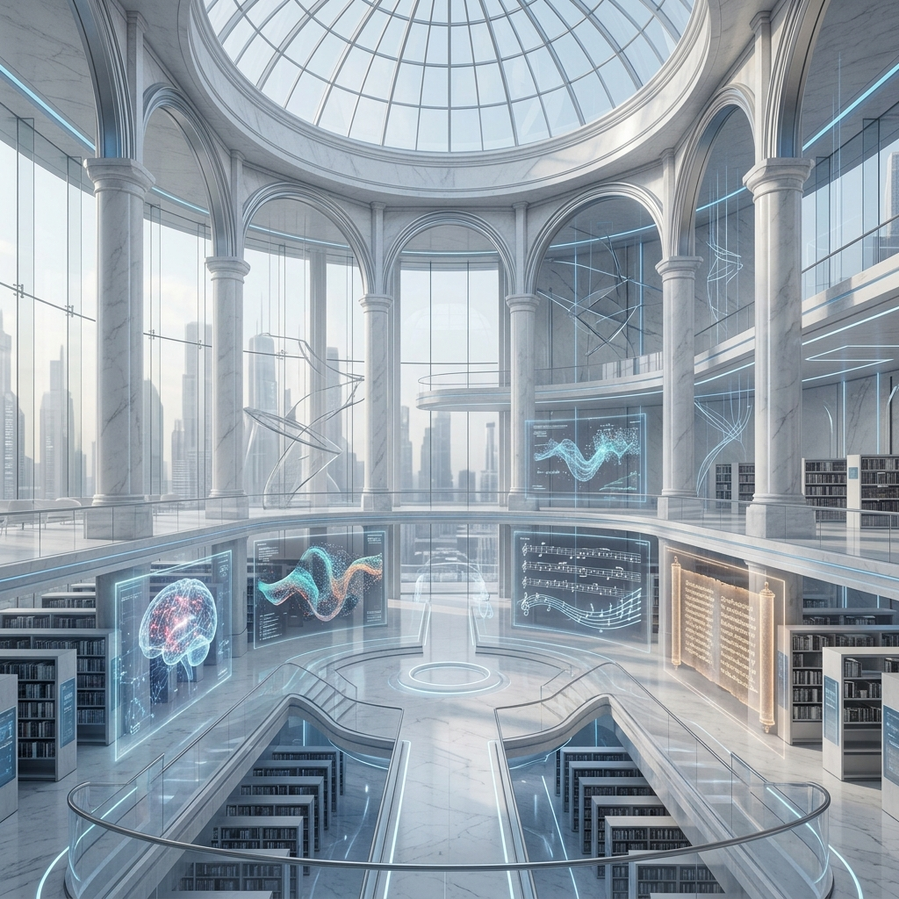

# 📚 UNIVERSITY COURSES
### *Solopreneurlar İçin Yüksek Yoğunluklu Bilgi Deposu* 🌐🧬🏗️

---

## 🦾 PROJE AMACI
Bu depo, **Solopreneur**'lar ve bağımsız araştırmacılar için akademik bilginin rafine edildiği fütüristik bir **Bilgi Kütüphanesi**dir. Karmaşık teorileri pratik uygulamalarla birleştirerek, bireysel gelişimi ve teknik hakimiyeti desteklemeyi amaçlar.

---

## 🪐 EPİSTEMİK VİZYON & FELSEFE

Bu kütüphane, bilginin sadece bir "tüketim nesnesi" değil, **Stratejik bir Egemenlik Aracı** olduğuna inanır. Organizasyon yapımız şu üç temel direk üzerine inşa edilmiştir:

*   **Bilişsel Egemenlik:** Bilgiyi şeffaflaştırarak, her bireyin kendi öğrenme yolculuğunun otonom mimarı olmasını sağlamak.
*   **Topolojik Navigasyon:** Kaotik enformasyon denizinde, disiplinler arası bağlantıları kullanarak kaybolmadan ilerlemek.
*   **Sentropik Birikim:** Karmaşıklığın (entropi) ötesinde, yapılandırılmış ve rafine edilmiş (sentropi) bir bilgi ekosistemi sunmak.

> [!TIP]
> *“Sapere Aude! Bilgin olmaya cüret et; kendi aklını kullanma cesaretini göster!”* — **Immanuel Kant**

---

### 📌 ANA BÖLÜMLER

| | | | |
| :--- | :--- | :--- | :--- |
| [🛠️ Mühendislik Bilimleri](./meta_muhendislik/) | [🏛️ Mimarlık ve Tasarım](./mimarlik_ve_tasarim/) | [🖼️ Güzel Sanatlar](./guzel_sanatlar/) | [🩺 Sağlık Bilimleri](./saglik/) |
| [🎓 Eğitim & Öğretmenlik](./ogretmenlik/) | [🏅 Spor Bilimleri](./spor_bilimleri/) | [⚖️ Sosyal & Beşeri](./sosyal_ve_beseri_bilimler/) | [🧪 Temel Bilimler](./temel_bilimler/) |
| [📚 Edebiyat ve Diller](./edebiyat_ve_diller/) | [📡 İletişim Bilimleri](./iletisim/) | [🏨 Turizm & Gastronomi](./turizm_ve_gastronomi/) | [🌱 Tarım & Ziraat](./tarim_ve_ziraat_bilimleri/) |
| [⚖️ Hukuk Bilimi](./hukuk_bilimi/) | [📚 İlahiyat ve Din](./ilahiyat_ve_din/) | [📋 Ön Lisans](./on_lisans_programlari/) | [🔬 Özel Araştırma](./ozel_arastirma_alanlari/) |
| [🚀 Kariyer & Sertifika](./kariyer_ve_sertifikasyonlar/) | [🧠 Meta-Yetkinlikler](./meta_yetkinlikler_ve_gelisim/) | [⚔️ Askeri Bilimler](./askeri_bilimler_ve_savunma_teknolojileri/) | [📂 Genel Alanlar](./genel/) |

## 🌌 THE UNIVERSAL DISCIPLINE MATRIX (374 NODES)
 

UAOS ekosistemindeki tüm akademik disiplinlerin yüksek yoğunluklu topolojik haritası.

---

### 👁️ EPİSTEMİK VİZYON & FELSEFE
|   |   |   |
| :--- | :--- | :--- |
| [Bilgi Ontolojisi](./epistemik/bilgi_ontolojisi/) | [Felsefi Sorgulama](./epistemik/felsefi_sorgulama/) | [Zihin Mimarisi](./epistemik/zihin_mimarisi/) |

---

### 🛠️ Mühendislik Bilimleri
> *“Bilim adamları olanı inceler; mühendisler ise hiç olmayanı yaratır.”* — **Theodore von Kármán**

|   |   |   |
| :--- | :--- | :--- |
| [Adli Bilisim Muhendisligi](./meta_muhendislik/adli_bilisim_muhendisligi/) | [Akilli Gorsel Isitsel Muhendislik](./meta_muhendislik/akilli_gorsel_isitsel_muhendislik/) | [Akilli Molekuler Muhendislik](./meta_muhendislik/akilli_molekuler_muhendislik/) |
| [Akilli Sebeke Bilgi Ve Muhendisligi](./meta_muhendislik/akilli_sebeke_bilgi_ve_muhendisligi/) | [Ambalaj Muhendisligi](./meta_muhendislik/ambalaj_muhendisligi/) | [Basim Teknolojileri](./meta_muhendislik/basim_teknolojileri/) |
| [Beyin Bilgisayar Arayuzu Bci Muhendisligi](./meta_muhendislik/beyin_bilgisayar_arayuzu_bci_muhendisligi/) | [Bilgisayar Muhendisligi](./meta_muhendislik/bilgisayar_muhendisligi/) | [Bilisim Sistemleri Muhendisligi](./meta_muhendislik/bilisim_sistemleri_muhendisligi/) |
| [Biyokimya Muhendisligi](./meta_muhendislik/biyokimya_muhendisligi/) | [Biyomedikal Muhendisligi](./meta_muhendislik/biyomedikal_muhendisligi/) | [Biyosistem Muhendisligi](./meta_muhendislik/biyosistem_muhendisligi/) |
| [Cevher Hazirlama Muhendisligi](./meta_muhendislik/cevher_hazirlama_muhendisligi/) | [Cevre Muhendisligi](./meta_muhendislik/cevre_muhendisligi/) | [Deniz Ulastirma Isletme Muhendisligi](./meta_muhendislik/deniz_ulastirma_isletme_muhendisligi/) |
| [Deri Muhendisligi](./meta_muhendislik/deri_muhendisligi/) | [Dusuk Irtifa Teknolojisi Ve Iha](./meta_muhendislik/dusuk_irtifa_teknolojisi_ve_iha/) | [Elektrik Elektronik Muhendisligi](./meta_muhendislik/elektrik_elektronik_muhendisligi/) |
| [Elektronik Ve Haberlesme Muhendisligi](./meta_muhendislik/elektronik_ve_haberlesme_muhendisligi/) | [Endustri Muhendisligi](./meta_muhendislik/endustri_muhendisligi/) | [Endustriyel Tasarim Muhendisligi](./meta_muhendislik/endustriyel_tasarim_muhendisligi/) |
| [Enerji Sistemleri Muhendisligi](./meta_muhendislik/enerji_sistemleri_muhendisligi/) | [Finans Muhendisligi](./meta_muhendislik/finans_muhendisligi/) | [Fizik Muhendisligi](./meta_muhendislik/fizik_muhendisligi/) |
| [Gemi Insaati Ve Gemi Makineleri Muhendisligi](./meta_muhendislik/gemi_insaati_ve_gemi_makineleri_muhendisligi/) | [Gemi Makineleri Isletme Muhendisligi](./meta_muhendislik/gemi_makineleri_isletme_muhendisligi/) | [Geomatik Muhendisligi](./meta_muhendislik/geomatik_muhendisligi/) |
| [Gida Muhendisligi](./meta_muhendislik/gida_muhendisligi/) | [Harita Muhendisligi](./meta_muhendislik/harita_muhendisligi/) | [Havacilik Ve Uzay Muhendisligi](./meta_muhendislik/havacilik_ve_uzay_muhendisligi/) |
| [Imalat Muhendisligi](./meta_muhendislik/imalat_muhendisligi/) | [Insaat Muhendisligi](./meta_muhendislik/insaat_muhendisligi/) | [Ipek Muhendisligi Ve Serikultur](./meta_muhendislik/ipek_muhendisligi_ve_serikultur/) |
| [Isletme Muhendisligi](./meta_muhendislik/isletme_muhendisligi/) | [Jeofizik Muhendisligi](./meta_muhendislik/jeofizik_muhendisligi/) | [Jeoloji Muhendisligi](./meta_muhendislik/jeoloji_muhendisligi/) |
| [Kagit Bilimi Ve Muhendisligi](./meta_muhendislik/kagit_bilimi_ve_muhendisligi/) | [Karbon Notr Bilimi Ve Teknolojisi](./meta_muhendislik/karbon_notr_bilimi_ve_teknolojisi/) | [Kimya Muhendisligi](./meta_muhendislik/kimya_muhendisligi/) |
| [Kontrol Ve Otomasyon Muhendisligi](./meta_muhendislik/kontrol_ve_otomasyon_muhendisligi/) | [Maden Muhendisligi](./meta_muhendislik/maden_muhendisligi/) | [Makine Muhendisligi](./meta_muhendislik/makine_muhendisligi/) |
| [Matematik Muhendisligi](./meta_muhendislik/matematik_muhendisligi/) | [Mekatronik Muhendisligi](./meta_muhendislik/mekatronik_muhendisligi/) | [Metalurji Ve Malzeme Muhendisligi](./meta_muhendislik/metalurji_ve_malzeme_muhendisligi/) |
| [Mikro Nano Sistemler Ve Mems](./meta_muhendislik/mikro_nano_sistemler_ve_mems/) | [Modelleme Ve Simulasyon](./meta_muhendislik/modelleme_ve_simulasyon/) | [Nanoteknoloji Muhendisligi](./meta_muhendislik/nanoteknoloji_muhendisligi/) |
| [Nukleer Enerji Muhendisligi](./meta_muhendislik/nukleer_enerji_muhendisligi/) | [Orman Muhendisligi](./meta_muhendislik/orman_muhendisligi/) | [Otomotiv Muhendisligi](./meta_muhendislik/otomotiv_muhendisligi/) |
| [Rayli Sistemler Muhendisligi](./meta_muhendislik/rayli_sistemler_muhendisligi/) | [Seramik Tasarimi Ve Muhendisligi](./meta_muhendislik/seramik_tasarimi_ve_muhendisligi/) | [Siber Guvenlik Muhendisligi](./meta_muhendislik/siber_guvenlik_muhendisligi/) |
| [Su Urunleri Muhendisligi](./meta_muhendislik/su_urunleri_muhendisligi/) | [Tarim Makineleri Ve Teknolojileri Muhendisligi](./meta_muhendislik/tarim_makineleri_ve_teknolojileri_muhendisligi/) | [Tekstil Muhendisligi](./meta_muhendislik/tekstil_muhendisligi/) |
| [Ucak Muhendisligi](./meta_muhendislik/ucak_muhendisligi/) | [Ulasim Muhendisligi](./meta_muhendislik/ulasim_muhendisligi/) | [Uzay Zaman Bilgi Muhendisligi](./meta_muhendislik/uzay_zaman_bilgi_muhendisligi/) |
| [Yapay Zeka Ve Veri Muhendisligi](./meta_muhendislik/yapay_zeka_ve_veri_muhendisligi/) | [Yazilim Muhendisligi](./meta_muhendislik/yazilim_muhendisligi/) | [Yuksek Guclu Yariiletken Bilimi Ve Muhendisligi](./meta_muhendislik/yuksek_guclu_yariiletken_bilimi_ve_muhendisligi/) |
| [Ziraat Muhendisligi](./meta_muhendislik/ziraat_muhendisligi/) |   |   |

---

### 🏛️ Mimarlık ve Tasarım
> *“Tasarım sadece nasıl göründüğü veya hissettirdiği değildir. Tasarım nasıl çalıştığıdır.”* — **Steve Jobs**

|   |   |   |
| :--- | :--- | :--- |
| [Cizgi Film Ve Animasyon](./mimarlik_ve_tasarim/cizgi_film_ve_animasyon/) | [Endustriyel Tasarim](./mimarlik_ve_tasarim/endustriyel_tasarim/) | [Gorsel Iletisim Tasarimi](./mimarlik_ve_tasarim/gorsel_iletisim_tasarimi/) |
| [Grafik Tasarimi](./mimarlik_ve_tasarim/grafik_tasarimi/) | [Ic Mimarlik Ve Cevre Tasarimi](./mimarlik_ve_tasarim/ic_mimarlik_ve_cevre_tasarimi/) | [Kultur Varliklarini Koruma Ve Onarim](./mimarlik_ve_tasarim/kultur_varliklarini_koruma_ve_onarim/) |
| [Kuyumculuk Ve Mucevher Tasarimi](./mimarlik_ve_tasarim/kuyumculuk_ve_mucevher_tasarimi/) | [Mimarlik](./mimarlik_ve_tasarim/mimarlik/) | [Mucevherat Ve Degerli Tas Bilimi](./mimarlik_ve_tasarim/mucevherat_ve_degerli_tas_bilimi/) |
| [Muzik](./mimarlik_ve_tasarim/muzik/) | [Peyzaj Mimarligi](./mimarlik_ve_tasarim/peyzaj_mimarligi/) | [Sehir Ve Bolge Planlama](./mimarlik_ve_tasarim/sehir_ve_bolge_planlama/) |
| [Seramik Ve Cam Tasarimi](./mimarlik_ve_tasarim/seramik_ve_cam_tasarimi/) | [Tekstil Ve Moda Tasarimi](./mimarlik_ve_tasarim/tekstil_ve_moda_tasarimi/) | [Tiyatro Oyunculuk](./mimarlik_ve_tasarim/tiyatro_oyunculuk/) |

---

### 🖼️ Güzel Sanatlar
> *“Her çocuk bir sanatçıdır, mesele büyüdüğünde sanatçı kalabilmektir.”* — **Pablo Picasso**

|   |   |   |
| :--- | :--- | :--- |
| [Dijital Tiyatro](./guzel_sanatlar/dijital_tiyatro/) | [El Sanatlari](./guzel_sanatlar/el_sanatlari/) | [Fotograf](./guzel_sanatlar/fotograf/) |
| [Geleneksel Cin Operasi Ve Muzigi](./guzel_sanatlar/geleneksel_cin_operasi_ve_muzigi/) | [Geleneksel Turk Sanatlari](./guzel_sanatlar/geleneksel_turk_sanatlari/) | [Guzel Sanatlar Arastirma](./guzel_sanatlar/guzel_sanatlar_arastirma/) |
| [Heykel](./guzel_sanatlar/heykel/) | [Resim](./guzel_sanatlar/resim/) |   |

---

### 🩺 Sağlık Bilimleri
> *“Hastalık yoktur, hasta vardır.”* — **Hipokrat**

|   |   |   |
| :--- | :--- | :--- |
| [Acil Yardim Ve Afet Yonetimi](./saglik/acil_yardim_ve_afet_yonetimi/) | [Akupunktur Ve Moxibustion](./saglik/akupunktur_ve_moxibustion/) | [Ameliyathane Hizmetleri](./saglik/ameliyathane_hizmetleri/) |
| [Anestezi Ve Reanimasyon](./saglik/anestezi_ve_reanimasyon/) | [Beslenme Ve Diyetetik](./saglik/beslenme_ve_diyetetik/) | [Cocuk Gelisimi](./saglik/cocuk_gelisimi/) |
| [Dil Ve Konusma Terapisi](./saglik/dil_ve_konusma_terapisi/) | [Dis Hekimligi](./saglik/dis_hekimligi/) | [Ebelik](./saglik/ebelik/) |
| [Eczacilik](./saglik/eczacilik/) | [Ergoterapi](./saglik/ergoterapi/) | [Fizyoterapi Ve Rehabilitasyon](./saglik/fizyoterapi_ve_rehabilitasyon/) |
| [Geleneksel Cin Tibbi](./saglik/geleneksel_cin_tibbi/) | [Geleneksel Cin Veteriner Hekimligi](./saglik/geleneksel_cin_veteriner_hekimligi/) | [Gerontoloji](./saglik/gerontoloji/) |
| [Hemsirelik](./saglik/hemsirelik/) | [Is Ve Ugrasi Terapisi](./saglik/is_ve_ugrasi_terapisi/) | [Medikal Cihaz Ve Ekipman Muhendisligi](./saglik/medikal_cihaz_ve_ekipman_muhendisligi/) |
| [Molekuler Biyoloji Ve Genetik](./saglik/molekuler_biyoloji_ve_genetik/) | [Nukleer Eczacilik](./saglik/nukleer_eczacilik/) | [Odyoloji](./saglik/odyoloji/) |
| [Ozurluluk Calismalari](./saglik/ozurluluk_calismalari/) | [Perfuzyon](./saglik/perfuzyon/) | [Saglik Bilimi Ve Teknolojisi](./saglik/saglik_bilimi_ve_teknolojisi/) |
| [Saglik Ve Tibbi Guvenlik](./saglik/saglik_ve_tibbi_guvenlik/) | [Saglik Yonetimi](./saglik/saglik_yonetimi/) | [Tibbi Goruntuleme Teknikleri](./saglik/tibbi_goruntuleme_teknikleri/) |
| [Tibbi Laboratuvar Teknikleri](./saglik/tibbi_laboratuvar_teknikleri/) | [Tip](./saglik/tip/) | [Veterinerlik](./saglik/veterinerlik/) |

---

### 🎓 Eğitim ve Öğretmenlik
> *“Öğretmen bir kandile benzer, kendini tüketerek başkalarına ışık verir.”* — **Mustafa Kemal Atatürk**

|   |   |   |
| :--- | :--- | :--- |
| [Beden Egitimi Ve Spor Ogretmenligi](./ogretmenlik/beden_egitimi_ve_spor_ogretmenligi/) | [Bilgisayar Ve Ogretim Teknolojileri Egitimi](./ogretmenlik/bilgisayar_ve_ogretim_teknolojileri_egitimi/) | [Din Kulturu Ve Ahlak Bilgisi Ogretmenligi](./ogretmenlik/din_kulturu_ve_ahlak_bilgisi_ogretmenligi/) |
| [Egitim Yonetimi](./ogretmenlik/egitim_yonetimi/) | [Fen Bilgisi Ogretmenligi](./ogretmenlik/fen_bilgisi_ogretmenligi/) | [Ilkogretim Matematik Ogretmenligi](./ogretmenlik/ilkogretim_matematik_ogretmenligi/) |
| [Ingilizce Ogretmenligi](./ogretmenlik/ingilizce_ogretmenligi/) | [Muzik Ogretmenligi](./ogretmenlik/muzik_ogretmenligi/) | [Okul Oncesi Ogretmenligi](./ogretmenlik/okul_oncesi_ogretmenligi/) |
| [Ozel Egitim Ogretmenligi](./ogretmenlik/ozel_egitim_ogretmenligi/) | [Rehberlik Ve Psikolojik Danismanlik](./ogretmenlik/rehberlik_ve_psikolojik_danismanlik/) | [Resim Is Ogretmenligi](./ogretmenlik/resim_is_ogretmenligi/) |
| [Saglik Bilgisi Ogretmenligi](./ogretmenlik/saglik_bilgisi_ogretmenligi/) | [Sinif Ogretmenligi](./ogretmenlik/sinif_ogretmenligi/) | [Sosyal Bilgiler Ogretmenligi](./ogretmenlik/sosyal_bilgiler_ogretmenligi/) |
| [Turkce Ogretmenligi](./ogretmenlik/turkce_ogretmenligi/) |   |   |

---

### 🏅 Spor Bilimleri
|   |   |   |
| :--- | :--- | :--- |
| [Antrenorluk Egitimi](./spor_bilimleri/antrenorluk_egitimi/) | [Beden Egitimi Ve Spor Bilimleri](./spor_bilimleri/beden_egitimi_ve_spor_bilimleri/) | [Buz Ve Kar Dansi Performansi](./spor_bilimleri/buz_ve_kar_dansi_performansi/) |
| [Futbol Bilimi](./spor_bilimleri/futbol_bilimi/) | [Geleneksel Cin Savas Sanatlari Wushu](./spor_bilimleri/geleneksel_cin_savas_sanatlari_wushu/) | [Havacilik Sporlari](./spor_bilimleri/havacilik_sporlari/) |
| [Rekreasyon](./spor_bilimleri/rekreasyon/) | [Spor Yoneticiligi](./spor_bilimleri/spor_yoneticiligi/) |   |

---

### ⚖️ Sosyal ve Beşeri Bilimler
|   |   |   |
| :--- | :--- | :--- |
| [Aktüerya Bilimleri](./sosyal_ve_beseri_bilimler/aktüerya_bilimleri/) | [Antropoloji](./sosyal_ve_beseri_bilimler/antropoloji/) | [Arkeoloji](./sosyal_ve_beseri_bilimler/arkeoloji/) |
| [Bolgesel Ve Ulke Arastirmalari](./sosyal_ve_beseri_bilimler/bolgesel_ve_ulke_arastirmalari/) | [Calisma Ekonomisi Ve Endustri Iliskileri](./sosyal_ve_beseri_bilimler/calisma_ekonomisi_ve_endustri_iliskileri/) | [Cografya](./sosyal_ve_beseri_bilimler/cografya/) |
| [Dilbilim](./sosyal_ve_beseri_bilimler/dilbilim/) | [Dis Ticaret](./sosyal_ve_beseri_bilimler/dis_ticaret/) | [Ekonometri](./sosyal_ve_beseri_bilimler/ekonometri/) |
| [Ekonomi](./sosyal_ve_beseri_bilimler/ekonomi/) | [Enerji Yonetimi](./sosyal_ve_beseri_bilimler/enerji_yonetimi/) | [Felsefe](./sosyal_ve_beseri_bilimler/felsefe/) |
| [Girisimcilik](./sosyal_ve_beseri_bilimler/girisimcilik/) | [Halk Bilimi](./sosyal_ve_beseri_bilimler/halk_bilimi/) | [Halkbilimi](./sosyal_ve_beseri_bilimler/halkbilimi/) |
| [Havacilik Yonetimi](./sosyal_ve_beseri_bilimler/havacilik_yonetimi/) | [Iktisat](./sosyal_ve_beseri_bilimler/iktisat/) | [Insan Kaynaklari Yonetimi](./sosyal_ve_beseri_bilimler/insan_kaynaklari_yonetimi/) |
| [Isletme](./sosyal_ve_beseri_bilimler/isletme/) | [Kutuphanecilik Ve Bilgi Yonetimi](./sosyal_ve_beseri_bilimler/kutuphanecilik_ve_bilgi_yonetimi/) | [Lojistik Yonetimi](./sosyal_ve_beseri_bilimler/lojistik_yonetimi/) |
| [Maliye](./sosyal_ve_beseri_bilimler/maliye/) | [Muhasebe Ve Finans Yonetimi](./sosyal_ve_beseri_bilimler/muhasebe_ve_finans_yonetimi/) | [Muze Yonetimi](./sosyal_ve_beseri_bilimler/muze_yonetimi/) |
| [Muzeoloji Ve Arsivcilik](./sosyal_ve_beseri_bilimler/muzeoloji_ve_arsivcilik/) | [Psikoloji](./sosyal_ve_beseri_bilimler/psikoloji/) | [Sanat Tarihi](./sosyal_ve_beseri_bilimler/sanat_tarihi/) |
| [Sanat Yonetimi](./sosyal_ve_beseri_bilimler/sanat_yonetimi/) | [Sigortacilik Ve Risk Yonetimi](./sosyal_ve_beseri_bilimler/sigortacilik_ve_risk_yonetimi/) | [Siyaset Bilimi Ve Kamu Yonetimi](./sosyal_ve_beseri_bilimler/siyaset_bilimi_ve_kamu_yonetimi/) |
| [Sosyal Hizmet](./sosyal_ve_beseri_bilimler/sosyal_hizmet/) | [Sosyoloji](./sosyal_ve_beseri_bilimler/sosyoloji/) | [Stratejik Hammadde Ekonomisi](./sosyal_ve_beseri_bilimler/stratejik_hammadde_ekonomisi/) |
| [Su Sektoru Ekonomisi Ve Yonetimi](./sosyal_ve_beseri_bilimler/su_sektoru_ekonomisi_ve_yonetimi/) | [Tarih](./sosyal_ve_beseri_bilimler/tarih/) | [Uluslararasi Iliskiler](./sosyal_ve_beseri_bilimler/uluslararasi_iliskiler/) |
| [Uluslararasi Ticaret Ve Lojistik](./sosyal_ve_beseri_bilimler/uluslararasi_ticaret_ve_lojistik/) | [Yenilik Yonetimi](./sosyal_ve_beseri_bilimler/yenilik_yonetimi/) | [Yonetim Bilisim Sistemleri](./sosyal_ve_beseri_bilimler/yonetim_bilisim_sistemleri/) |

---

### 🧪 Temel Bilimler
> *“Önemli olan sorgulamayı bırakmamaktır. Merakın kendi varoluş nedeni vardır.”* — **Albert Einstein**

|   |   |   |
| :--- | :--- | :--- |
| [Astronomi Ve Uzay Bilimleri](./temel_bilimler/astronomi_ve_uzay_bilimleri/) | [Biyoistatistik](./temel_bilimler/biyoistatistik/) | [Biyoloji](./temel_bilimler/biyoloji/) |
| [Deniz Bilimleri Ve Teknolojisi](./temel_bilimler/deniz_bilimleri_ve_teknolojisi/) | [Ekolojik Restorasyon](./temel_bilimler/ekolojik_restorasyon/) | [Fizik](./temel_bilimler/fizik/) |
| [Istatistik](./temel_bilimler/istatistik/) | [Jeoloji](./temel_bilimler/jeoloji/) | [Kimya](./temel_bilimler/kimya/) |
| [Matematik](./temel_bilimler/matematik/) | [Sulak Alan Bilimi Ve Yonetimi](./temel_bilimler/sulak_alan_bilimi_ve_yonetimi/) | [Yer Bilimleri](./temel_bilimler/yer_bilimleri/) |

---

### 📚 Edebiyat ve Diller
|   |   |   |
| :--- | :--- | :--- |
| [Alman Dili Ve Edebiyati](./edebiyat_ve_diller/alman_dili_ve_edebiyati/) | [Arap Dili Ve Edebiyati](./edebiyat_ve_diller/arap_dili_ve_edebiyati/) | [Cin Dili Ve Edebiyati](./edebiyat_ve_diller/cin_dili_ve_edebiyati/) |
| [Cin Klasik Calismalari](./edebiyat_ve_diller/cin_klasik_calismalari/) | [Dogu Kulturleri Ve Bolge Arastirmalari](./edebiyat_ve_diller/dogu_kulturleri_ve_bolge_arastirmalari/) | [Fars Dili Ve Edebiyati](./edebiyat_ve_diller/fars_dili_ve_edebiyati/) |
| [Fransiz Dili Ve Edebiyati](./edebiyat_ve_diller/fransiz_dili_ve_edebiyati/) | [Hititoloji](./edebiyat_ve_diller/hititoloji/) | [Ingiliz Dili Ve Edebiyati](./edebiyat_ve_diller/ingiliz_dili_ve_edebiyati/) |
| [Ispanyol Dili Ve Edebiyati](./edebiyat_ve_diller/ispanyol_dili_ve_edebiyati/) | [Italyan Dili Ve Edebiyati](./edebiyat_ve_diller/italyan_dili_ve_edebiyati/) | [Japon Dili Ve Edebiyati](./edebiyat_ve_diller/japon_dili_ve_edebiyati/) |
| [Kore Dili Ve Edebiyati](./edebiyat_ve_diller/kore_dili_ve_edebiyati/) | [Mutercim Ve Tercumanlik](./edebiyat_ve_diller/mutercim_ve_tercumanlik/) | [Rus Dili Ve Edebiyati](./edebiyat_ve_diller/rus_dili_ve_edebiyati/) |
| [Sumeroloji](./edebiyat_ve_diller/sumeroloji/) | [Turk Dili Ve Edebiyati](./edebiyat_ve_diller/turk_dili_ve_edebiyati/) |   |

---

### 📡 İletişim Bilimleri
|   |   |   |
| :--- | :--- | :--- |
| [Gazetecilik](./iletisim/gazetecilik/) | [Halkla Iliskiler Ve Reklamcilik](./iletisim/halkla_iliskiler_ve_reklamcilik/) | [Radyo Televizyon Ve Sinema](./iletisim/radyo_televizyon_ve_sinema/) |
| [Yeni Medya Ve Iletisim](./iletisim/yeni_medya_ve_iletisim/) |   |   |

---

### 🏨 Turizm ve Gastronomi
> *“Dünya bir kitaptır ve seyahat etmeyenler onun sadece bir sayfasını okurlar.”* — **Aziz Augustinus**

|   |   |   |
| :--- | :--- | :--- |
| [Gastronomi Ve Mutfak Sanatlari](./turizm_ve_gastronomi/gastronomi_ve_mutfak_sanatlari/) | [Kahve Bilimi Ve Muhendisligi](./turizm_ve_gastronomi/kahve_bilimi_ve_muhendisligi/) | [Konaklama Isletmeciligi](./turizm_ve_gastronomi/konaklama_isletmeciligi/) |
| [Turizm Isletmeciligi](./turizm_ve_gastronomi/turizm_isletmeciligi/) | [Turizm Rehberligi](./turizm_ve_gastronomi/turizm_rehberligi/) | [Uluslararasi Kruvaziyer Yonetimi](./turizm_ve_gastronomi/uluslararasi_kruvaziyer_yonetimi/) |
| [Yiyecek Icecek Isletmeciligi](./turizm_ve_gastronomi/yiyecek_icecek_isletmeciligi/) |   |   |

---

### 🌱 Tarım ve Ziraat Bilimleri
|   |   |   |
| :--- | :--- | :--- |
| [Bahce Bitkileri](./tarim_ve_ziraat_bilimleri/bahce_bitkileri/) | [Bitki Koruma](./tarim_ve_ziraat_bilimleri/bitki_koruma/) | [Biyolojik Islah Teknolojisi](./tarim_ve_ziraat_bilimleri/biyolojik_islah_teknolojisi/) |
| [Cay Bilimi Ve Teknolojisi](./tarim_ve_ziraat_bilimleri/cay_bilimi_ve_teknolojisi/) | [Tarla Bitkileri](./tarim_ve_ziraat_bilimleri/tarla_bitkileri/) | [Toprak Bilimi Ve Bitki Besleme](./tarim_ve_ziraat_bilimleri/toprak_bilimi_ve_bitki_besleme/) |
| [Tutun Bilimi](./tarim_ve_ziraat_bilimleri/tutun_bilimi/) | [Zootekni](./tarim_ve_ziraat_bilimleri/zootekni/) |   |

---

### ⚖️ Hukuk
> *“Adalet mülkün temelidir.”* — **Hz. Ömer**

|   |   |   |
| :--- | :--- | :--- |
| [Deniz Hukuku Ve Stratejisi](./hukuk_bilimi/deniz_hukuku_ve_stratejisi/) | [Hukuk](./hukuk_bilimi/hukuk/) |   |

---

### 📚 Theology and Comparative Religion
|   |   |   |
| :--- | :--- | :--- |
| [Ilahiyat](./ilahiyat_ve_din/ilahiyat/) |   |   |

---

### 📋 Ön Lisans Programları
|   |   |   |
| :--- | :--- | :--- |
| [Adalet](./on_lisans_programlari/adalet/) | [Agiz Ve Dis Sagligi](./on_lisans_programlari/agiz_ve_dis_sagligi/) | [Aricilik](./on_lisans_programlari/aricilik/) |
| [Asansor Teknolojisi](./on_lisans_programlari/asansor_teknolojisi/) | [Ascilik](./on_lisans_programlari/ascilik/) | [Atik Yonetimi](./on_lisans_programlari/atik_yonetimi/) |
| [Avcilik Ve Yaban Hayati](./on_lisans_programlari/avcilik_ve_yaban_hayati/) | [Bagcilik](./on_lisans_programlari/bagcilik/) | [Bankacilik Ve Sigortacilik](./on_lisans_programlari/bankacilik_ve_sigortacilik/) |
| [Bankacilik Ve Sigortacilik Onlisans](./on_lisans_programlari/bankacilik_ve_sigortacilik_onlisans/) | [Bilgisayar Destekli Tasarim Ve Animasyon](./on_lisans_programlari/bilgisayar_destekli_tasarim_ve_animasyon/) | [Bilgisayar Programciligi](./on_lisans_programlari/bilgisayar_programciligi/) |
| [Buro Yonetimi Ve Yonetici Asistanligi](./on_lisans_programlari/buro_yonetimi_ve_yonetici_asistanligi/) | [Buyukbas Hayvan Yetistiriciligi](./on_lisans_programlari/buyukbas_hayvan_yetistiriciligi/) | [Cay Tarimi Ve Isleme](./on_lisans_programlari/cay_tarimi_ve_isleme/) |
| [Deniz Ulastirma Ve Isletme Onlisans](./on_lisans_programlari/deniz_ulastirma_ve_isletme_onlisans/) | [Dis Ticaret Onlisans](./on_lisans_programlari/dis_ticaret_onlisans/) | [Diyaliz](./on_lisans_programlari/diyaliz/) |
| [Eczane Hizmetleri](./on_lisans_programlari/eczane_hizmetleri/) | [Elektronik Teknolojisi](./on_lisans_programlari/elektronik_teknolojisi/) | [Elektronorofizyoloji](./on_lisans_programlari/elektronorofizyoloji/) |
| [Evde Hasta Bakimi](./on_lisans_programlari/evde_hasta_bakimi/) | [Fidan Yetistiriciligi](./on_lisans_programlari/fidan_yetistiriciligi/) | [Gemi Insaati Onlisans](./on_lisans_programlari/gemi_insaati_onlisans/) |
| [Gemi Makineleri Isletme Onlisans](./on_lisans_programlari/gemi_makineleri_isletme_onlisans/) | [Grafik Tasarimi Onlisans](./on_lisans_programlari/grafik_tasarimi_onlisans/) | [Halkla Iliskiler Ve Tanitim Onlisans](./on_lisans_programlari/halkla_iliskiler_ve_tanitim_onlisans/) |
| [Harita Ve Kadastro](./on_lisans_programlari/harita_ve_kadastro/) | [Ilk Ve Acil Yardim](./on_lisans_programlari/ilk_ve_acil_yardim/) | [Insaat Teknolojisi Onlisans](./on_lisans_programlari/insaat_teknolojisi_onlisans/) |
| [Is Sagligi Ve Guvenligi](./on_lisans_programlari/is_sagligi_ve_guvenligi/) | [Is Sagligi Ve Guvenligi Onlisans](./on_lisans_programlari/is_sagligi_ve_guvenligi_onlisans/) | [Is Ve Ugrasi Terapisi Onlisans](./on_lisans_programlari/is_ve_ugrasi_terapisi_onlisans/) |
| [Itfaiyecilik Ve Sivil Savunma](./on_lisans_programlari/itfaiyecilik_ve_sivil_savunma/) | [Kabin Hizmetleri](./on_lisans_programlari/kabin_hizmetleri/) | [Laboratuvar Teknolojisi](./on_lisans_programlari/laboratuvar_teknolojisi/) |
| [Lojistik Onlisans](./on_lisans_programlari/lojistik_onlisans/) | [Makine Resim Ve Konstruksiyon](./on_lisans_programlari/makine_resim_ve_konstruksiyon/) | [Mekatronik Onlisans](./on_lisans_programlari/mekatronik_onlisans/) |
| [Muhasebe Ve Vergi Uygulamalari](./on_lisans_programlari/muhasebe_ve_vergi_uygulamalari/) | [Nukleer Tip Teknikleri](./on_lisans_programlari/nukleer_tip_teknikleri/) | [Optisyenlik](./on_lisans_programlari/optisyenlik/) |
| [Organik Tarim](./on_lisans_programlari/organik_tarim/) | [Ortopedik Protez Ve Ortez](./on_lisans_programlari/ortopedik_protez_ve_ortez/) | [Ozel Guvenlik Ve Koruma](./on_lisans_programlari/ozel_guvenlik_ve_koruma/) |
| [Patoloji Laboratuvar Teknikleri](./on_lisans_programlari/patoloji_laboratuvar_teknikleri/) | [Perfuzyon Teknikleri](./on_lisans_programlari/perfuzyon_teknikleri/) | [Podoloji](./on_lisans_programlari/podoloji/) |
| [Polis Meslek Yuksekokulu Dersleri](./on_lisans_programlari/polis_meslek_yuksekokulu_dersleri/) | [Radyoterapi](./on_lisans_programlari/radyoterapi/) | [Rayli Sistemler Elektrik Elektronik Teknolojisi](./on_lisans_programlari/rayli_sistemler_elektrik_elektronik_teknolojisi/) |
| [Rayli Sistemler Isletmeciligi](./on_lisans_programlari/rayli_sistemler_isletmeciligi/) | [Rayli Sistemler Makine Teknolojisi](./on_lisans_programlari/rayli_sistemler_makine_teknolojisi/) | [Saglik Kurumlari Isletmeciligi](./on_lisans_programlari/saglik_kurumlari_isletmeciligi/) |
| [Seracilik](./on_lisans_programlari/seracilik/) | [Sivil Hava Ulastirma Isletmeciligi Onlisans](./on_lisans_programlari/sivil_hava_ulastirma_isletmeciligi_onlisans/) | [Sivil Havacilik Kabin Hizmetleri](./on_lisans_programlari/sivil_havacilik_kabin_hizmetleri/) |
| [Sivil Savunma Ve Itfaiyecilik](./on_lisans_programlari/sivil_savunma_ve_itfaiyecilik/) | [Sosyal Hizmetler Onlisans](./on_lisans_programlari/sosyal_hizmetler_onlisans/) | [Su Urunleri Isletme Teknolojisi](./on_lisans_programlari/su_urunleri_isletme_teknolojisi/) |
| [Sualti Teknolojisi](./on_lisans_programlari/sualti_teknolojisi/) | [Sut Ve Besi Hayvanciligi](./on_lisans_programlari/sut_ve_besi_hayvanciligi/) | [Tibbi Dokumantasyon Ve Sekreterlik](./on_lisans_programlari/tibbi_dokumantasyon_ve_sekreterlik/) |
| [Tibbi Tanitim Ve Pazarlama](./on_lisans_programlari/tibbi_tanitim_ve_pazarlama/) | [Turizm Ve Otel Isletmeciligi Onlisans](./on_lisans_programlari/turizm_ve_otel_isletmeciligi_onlisans/) | [Turizm Ve Seyahat Hizmetleri](./on_lisans_programlari/turizm_ve_seyahat_hizmetleri/) |
| [Tıbbi Ve Aromatik Bitkiler](./on_lisans_programlari/tıbbi_ve_aromatik_bitkiler/) | [Ucak Teknolojisi](./on_lisans_programlari/ucak_teknolojisi/) | [Un Ve Unlu Mamuller Teknolojisi](./on_lisans_programlari/un_ve_unlu_mamuller_teknolojisi/) |
| [Yasli Bakimi](./on_lisans_programlari/yasli_bakimi/) | [Yat Isletme Ve Yonetimi](./on_lisans_programlari/yat_isletme_ve_yonetimi/) | [Yerel Yonetimler](./on_lisans_programlari/yerel_yonetimler/) |

---

### 🔬 Özel Araştırma Alanları
|   |   |   |
| :--- | :--- | :--- |
| [3D Print Ai](./ozel_arastirma_alanlari/3d_print_ai/) | [Agro Tek Ve Topraksiz Tarim](./ozel_arastirma_alanlari/agro_tek_ve_topraksiz_tarim/) | [Akustik Muhendisligi](./ozel_arastirma_alanlari/akustik_muhendisligi/) |
| [Algorithmic Governance](./ozel_arastirma_alanlari/algorithmic_governance/) | [Artirilmis Gerceklik Muhendisligi](./ozel_arastirma_alanlari/artirilmis_gerceklik_muhendisligi/) | [Bci](./ozel_arastirma_alanlari/bci/) |
| [Bio Hacking Ve Longevity](./ozel_arastirma_alanlari/bio_hacking_ve_longevity/) | [Biyoinformatik](./ozel_arastirma_alanlari/biyoinformatik/) | [Biyoteknik Nanotip](./ozel_arastirma_alanlari/biyoteknik_nanotip/) |
| [Blokzincir Ve Web3](./ozel_arastirma_alanlari/blokzincir_ve_web3/) | [Climate Tech Ve Karbon Yakalama](./ozel_arastirma_alanlari/climate_tech_ve_karbon_yakalama/) | [Contex Engineering](./ozel_arastirma_alanlari/contex_engineering/) |
| [Cyber Physical Systems](./ozel_arastirma_alanlari/cyber_physical_systems/) | [Fintek Ai](./ozel_arastirma_alanlari/fintek_ai/) | [Guvenlik Bilimleri Ve Strateji](./ozel_arastirma_alanlari/guvenlik_bilimleri_ve_strateji/) |
| [Hukuk Ve Ai Etigi](./ozel_arastirma_alanlari/hukuk_ve_ai_etigi/) | [Kamu Guvenligi Muhendisligi](./ozel_arastirma_alanlari/kamu_guvenligi_muhendisligi/) | [Kuantum Iletisim Ve Kriptografi](./ozel_arastirma_alanlari/kuantum_iletisim_ve_kriptografi/) |
| [Kuantum Muhendisligi](./ozel_arastirma_alanlari/kuantum_muhendisligi/) | [Longevity Science Advanced](./ozel_arastirma_alanlari/longevity_science_advanced/) | [Merkeziyetsiz Finans Defi](./ozel_arastirma_alanlari/merkeziyetsiz_finans_defi/) |
| [Metaverse](./ozel_arastirma_alanlari/metaverse/) | [Muhendislik Ortak](./ozel_arastirma_alanlari/muhendislik_ortak/) | [Nanoteknoloji Ai](./ozel_arastirma_alanlari/nanoteknoloji_ai/) |
| [Neuro Design](./ozel_arastirma_alanlari/neuro_design/) | [Noro Muhendisligi](./ozel_arastirma_alanlari/noro_muhendisligi/) | [Optik Muhendisligi](./ozel_arastirma_alanlari/optik_muhendisligi/) |
| [Osint Ileri Seviye](./ozel_arastirma_alanlari/osint_ileri_seviye/) | [Osint Ve Siber Istihbarat](./ozel_arastirma_alanlari/osint_ve_siber_istihbarat/) | [Patlayici Muhendisligi](./ozel_arastirma_alanlari/patlayici_muhendisligi/) |
| [Prompt Engineering Pro](./ozel_arastirma_alanlari/prompt_engineering_pro/) | [Prompt Muhendisligi](./ozel_arastirma_alanlari/prompt_muhendisligi/) | [Psikolojik Harp Ve Sosyal Muhendislik](./ozel_arastirma_alanlari/psikolojik_harp_ve_sosyal_muhendislik/) |
| [Regenerative Medicine](./ozel_arastirma_alanlari/regenerative_medicine/) | [Savunma Sanayii Stratejileri](./ozel_arastirma_alanlari/savunma_sanayii_stratejileri/) | [Ton Os Ekosistemi](./ozel_arastirma_alanlari/ton_os_ekosistemi/) |
| [Ulusal Guvenlik Arastirmalari Ileri](./ozel_arastirma_alanlari/ulusal_guvenlik_arastirmalari_ileri/) | [Uzay Madenciligi Ve Lojistigi](./ozel_arastirma_alanlari/uzay_madenciligi_ve_lojistigi/) | [Yurtdisi Cikarlarin Guvenligi Ve Korunmasi](./ozel_arastirma_alanlari/yurtdisi_cikarlarin_guvenligi_ve_korunmasi/) |

---

### 🚀 Kariyer ve Sertifikasyonlar
|   |   |   |
| :--- | :--- | :--- |
| [Aws Certified Architect](./kariyer_ve_sertifikasyonlar/aws_certified_architect/) | [Cfa Chartered Financial Analyst](./kariyer_ve_sertifikasyonlar/cfa_chartered_financial_analyst/) | [Cisco Ccna Ccnp](./kariyer_ve_sertifikasyonlar/cisco_ccna_ccnp/) |
| [Comptia A Plus Sec Plus](./kariyer_ve_sertifikasyonlar/comptia_a_plus_sec_plus/) | [Delf Dalf Fransizca](./kariyer_ve_sertifikasyonlar/delf_dalf_fransizca/) | [Goethe Zertifikat Almanca](./kariyer_ve_sertifikasyonlar/goethe_zertifikat_almanca/) |
| [Google Cloud Professional](./kariyer_ve_sertifikasyonlar/google_cloud_professional/) | [Itil V4 Foundation](./kariyer_ve_sertifikasyonlar/itil_v4_foundation/) | [Microsoft Azure Solutions](./kariyer_ve_sertifikasyonlar/microsoft_azure_solutions/) |
| [Pmp Proje Yonetimi](./kariyer_ve_sertifikasyonlar/pmp_proje_yonetimi/) | [Six Sigma Green Black Belt](./kariyer_ve_sertifikasyonlar/six_sigma_green_black_belt/) | [Toefl Ielts Ingilizce](./kariyer_ve_sertifikasyonlar/toefl_ielts_ingilizce/) |

---

### 🧠 Meta-Yetkinlikler ve Gelişim
> *“Düşüncelerin neyse hayatın da odur.”* — **Marcus Aurelius**

|   |   |   |
| :--- | :--- | :--- |
| [Finansal Okuryazarlik Ve Yatirim](./meta_yetkinlikler_ve_gelisim/finansal_okuryazarlik_ve_yatirim/) | [Hizli Ogrenme Teknikleri](./meta_yetkinlikler_ve_gelisim/hizli_ogrenme_teknikleri/) | [Liderlik Ve Ekip Yonetimi](./meta_yetkinlikler_ve_gelisim/liderlik_ve_ekip_yonetimi/) |
| [Monk Mode Disiplin Sistemi](./meta_yetkinlikler_ve_gelisim/monk_mode_disiplin_sistemi/) | [Müzakere Ve Ikna Sanati](./meta_yetkinlikler_ve_gelisim/müzakere_ve_ikna_sanati/) | [Stoisizm Ve Mental Dayaniklılık](./meta_yetkinlikler_ve_gelisim/stoisizm_ve_mental_dayaniklılık/) |
| [Sun Tzu Stratejik Düşünce](./meta_yetkinlikler_ve_gelisim/sun_tzu_stratejik_düşünce/) | [Zaman Yonetimi Ve U U](./meta_yetkinlikler_ve_gelisim/zaman_yonetimi_ve_u_u/) |   |

---

### ⚔️ Askeri Bilimler ve Savunma
> *“En büyük zafer, savaşmadan kazanılandır.”* — **Sun Tzu**

|   |   |   |
| :--- | :--- | :--- |
| [Askeri Havacilik Ve Uzay](./askeri_bilimler_ve_savunma_teknolojileri/askeri_havacilik_ve_uzay/) | [Askeri Istihbarat Analizi](./askeri_bilimler_ve_savunma_teknolojileri/askeri_istihbarat_analizi/) | [Deniz Harp Ve Su Alti Stratejileri](./askeri_bilimler_ve_savunma_teknolojileri/deniz_harp_ve_su_alti_stratejileri/) |
| [Komuta Kontrol Ve Strateji](./askeri_bilimler_ve_savunma_teknolojileri/komuta_kontrol_ve_strateji/) | [Savunma Yonetimi Ve Lojistik](./askeri_bilimler_ve_savunma_teknolojileri/savunma_yonetimi_ve_lojistik/) | [Siber Savunma Ve Elektronik Harp](./askeri_bilimler_ve_savunma_teknolojileri/siber_savunma_ve_elektronik_harp/) |

---

### 📂 Genel ve Ortak Alanlar
|   |   |   |
| :--- | :--- | :--- |
| [Afet Yonetimi Ve Acil Durum Teknolojileri](./genel/afet_yonetimi_ve_acil_durum_teknolojileri/) | [Erasmus Ve Global Degisim Programlari](./genel/erasmus_ve_global_degisim_programlari/) | [Staj Ve Profesyonel Is Hayati Giris](./genel/staj_ve_profesyonel_is_hayati_giris/) |

---

---

## ⚖️ YASAL YÖNETİŞİM VE EPİSTEMİK HAKİMİYET
Bu proje, yüksek sadakatli bilginin serbest değişimini ve bireysel zihin otonomisini savunarak **MIT Lisansı** altında lisanslanmıştır. Bilgi, tüm insanlığın ortak mirasıdır ve kısıtlanamaz.

**Mimari İş Birliği**  
### Bahattin Yunus Çetin  
*Baş Mühendis ve Epistemik Araştırmacı*  
x  
### Antigravity  
*Otonom Sistemler Mimarı*

[Linkedin](https://linkedin.com/in/bahattinyunuscetin) | [GitHub](https://github.com/bahattinyunus)

---
*"Bilgi arayışı, merakla beslenen ve akılla terbiye edilen, sonu olmayan bir yolculuktur."*

---
© 2025 Evrensel Akademik İşletim Sistemi (UAOS).

